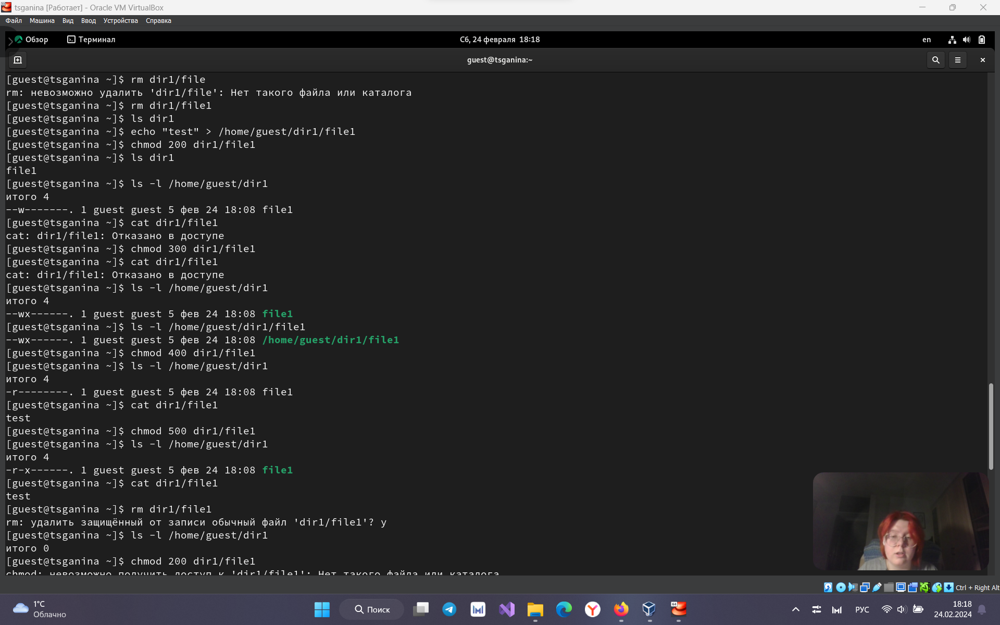

---
## Front matter
title: "Лабораторная работа №2"
subtitle: "Дискреционное разграничение прав в Linux. Основные атрибуты"
author: "Ганина Таисия Сергеевна, НКАбд-01-22"

## Generic otions
lang: ru-RU
toc-title: "Содержание"

## Bibliography
bibliography: bib/cite.bib
csl: pandoc/csl/gost-r-7-0-5-2008-numeric.csl

## Pdf output format
toc: true # Table of contents
toc-depth: 2
lof: true # List of figures
lot: true # List of tables
fontsize: 12pt
linestretch: 1.5
papersize: a4
documentclass: scrreprt
## I18n polyglossia
polyglossia-lang:
  name: russian
  options:
	- spelling=modern
	- babelshorthands=true
polyglossia-otherlangs:
  name: english
## I18n babel
babel-lang: russian
babel-otherlangs: english
## Fonts
mainfont: PT Serif
romanfont: PT Serif
sansfont: PT Sans
monofont: PT Mono
mainfontoptions: Ligatures=TeX
romanfontoptions: Ligatures=TeX
sansfontoptions: Ligatures=TeX,Scale=MatchLowercase
monofontoptions: Scale=MatchLowercase,Scale=0.9
## Biblatex
biblatex: true
biblio-style: "gost-numeric"
biblatexoptions:
  - parentracker=true
  - backend=biber
  - hyperref=auto
  - language=auto
  - autolang=other*
  - citestyle=gost-numeric
## Pandoc-crossref LaTeX customization
figureTitle: "Рис."
tableTitle: "Таблица"
listingTitle: "Листинг"
lofTitle: "Список иллюстраций"
lotTitle: "Список таблиц"
lolTitle: "Листинги"
## Misc options
indent: true
header-includes:
  - \usepackage{indentfirst}
  - \usepackage{float} # keep figures where there are in the text
  - \floatplacement{figure}{H} # keep figures where there are in the text
---

# Цель работы

Получение практических навыков работы в консоли с атрибутами файлов, закрепление теоретических основ дискреционного разграничения доступа в современных системах с открытым кодом на базе ОС Linux.

# Задание

1. Работа с атрибутами файлов.
2. Заполнение таблицы 2.1
3. Заполнение таблицы 2.2

# Теоретическое введение

В основе механизмов разграничения прав доступа лежат имена пользователей и имена групп пользователей. В Linux каждый пользователь имеет уникальное имя, под которым он входит в систему (логируется). Кроме того, в системе создается некоторое число групп пользователей, причем каждый пользователь может быть включен в одну или несколько групп.

Создает и удаляет группы системный администратор (суперпользователь), он же может изменять состав участников той или иной группы. Члены разных групп могут иметь разные права по доступу к файлам Linux.

Права доступа подразделяются на три типа:

- чтение — r (сокращение от read);
- запись — w (сокращение от write);
- выполнение — x (сокращение от execute).

Эти типы прав доступа могут быть предоставлены трем классам пользователей: владельцу файла, группе, в которую входит владелец, и всем (прочим) пользователям. Владельца и группу файла в дальнейшем можно поменять с помощью команд chown и chgrp.

Разрешение на чтение позволяет пользователю читать содержимое файлов, а в случае каталогов — просматривать перечень имен файлов в каталоге (используя, например, команду ls).

Разрешение на запись позволяет пользователю писать в файл и изменять его. Для каталогов это дает право создавать в каталоге новые файлы и каталоги, или удалять файлы в этом каталоге.

Разрешение на выполнение позволяет пользователю выполнять файлы (как бинарные программы, так и командные файлы). Разрешение на выполнение применительно к каталогам означает возможность выполнять команды, например, cd.

# Выполнение лабораторной работы

1. Создание нового пользователя, задание пароля (см. рис. @fig:001).

{#fig:001 width=70%}

2. Переключение на нового пользователя (см. рис. @fig:002).

{#fig:002 width=70%}

3. Определяю директорию, в которой нахожусь, командой pwd. Сравниваю её с приглашением командной строки. Она является домашней директорией (см. рис. @fig:003).

{#fig:003 width=70%}

4. Уточняю имя пользователя, группу, и группы куда входит пользователь. Имя пользователя совпадает с приглашением командной строки. Просматриваю файл /etc/passwd командой cat /etc/passwd, нахожу там свою учетную запись. (см. рис. @fig:004, @fig:005).

{#fig:004 width=70%}

{#fig:005 width=70%}

5. Определяю существующие в системе директории, посмотреть их получилось, права:
- guest: drwx------
- tsganina drwx------

Команда lsattr /home не работает. Увидеть не получилось ни расширенные атрибуты директории, ни расширенные атрибуты директорий других
пользователей (см. рис. @fig:006, @fig:007).

{#fig:006 width=70%}

{#fig:007 width=70%}

6. Создаю папку dir1. Определяю права доступа (см. рис. @fig:008).

{#fig:008 width=70%}

7. Снимаю все атрибуты. Проверяю правильность исполнения (см. рис. @fig:009).

{#fig:009 width=70%}

8. Пытаюсь создать файл file1. Отказано в доступе, потому что я ранее сняла все атрибуты доступа (см. рис. @fig:010).

{#fig:010 width=70%}

9. Выполняю тестовые действия для заполнения таблицы.

{#fig:011 width=70%}

{#fig:012 width=70%}

{#fig:013 width=70%}

{#fig:014 width=70%}

10. Таблица 2.1.

| | | | | | | | | | |
|-|-|-|-|-|-|-|-|-|-|
|Права директории|Права  файла|Создание  файла|Удаление  файла|Запись  в файл|Чтение  файла|Смена  директории|Просмотр файлов в  директории|Переименование файла|Смена  атрибутов  файла|
|d(000)|(000)| -| -| -| -| -| -| -| -|
|d(000)|(100)| -| -| -| -| -| -| -| -|
|d(000)|(200)| -| -| -| -| -| -| -| -|
|d(000)|(300)| -| -| -| -| -| -| -| -|
|d(000)|(400)| -| -| -| -| -| -| -| -|
|d(000)|(500)| -| -| -| -| -| -| -| -|
|d(000)|(600)| -| -| -| -| -| -| -| -|
|d(000)|(700)| -| -| -| -| -| -| -| -|
|d(100)|(000)| -| -| -| -|+| -| -|+|
|d(100)|(100)| -| -| -| -|+| -| -|+|
|d(100)|(200)| -| -|+| -|+| -| -|+|
|d(100)|(300)| -| -|+| -|+| -| -|+|
|d(100)|(400)| -| -|-|+|+| -| -|+|
|d(100)|(500)| -| -|-|+|+| -| -|+|
|d(100)|(600)| -| -|+|+|+| -| -|+|
|d(100)|(700)| -| -|+|+|+| -| -|+|
|d(200)|(000)| -| -|-|-|-| -| -|-|
|d(200)|(100)| -| -|-|-|-| -| -|-|
|d(200)|(200)| -| -|-|-|-| -| -|-|
|d(200)|(300)| -| -|-|-|-| -| -|-|
|d(200)|(400)| -| -|-|-|-| -| -|-|
|d(200)|(500)| -| -|-|-|-| -| -|-|
|d(200)|(600)| -| -|-|-|-| -| -|-|
|d(200)|(700)| -| -|-|-|-| -| -|-|
|d(300)|(000)|+|+|-|-|+| -|+|+|
|d(300)|(100)|+|+|-|-|+| -|+|+|
|d(300)|(200)|+|+|+|-|+| -|+|+|
|d(300)|(300)|+|+|+|-|+| -|+|+|
|d(300)|(400)|+|+|-|+|+| -|+|+|
|d(300)|(500)|+|+|-|+|+| -|+|+|
|d(300)|(600)|+|+|+|+|+| -|+|+|
|d(300)|(700)|+|+|+|+|+| -|+|+|
|d(400)|(000)|-|-|-|-|-|+|-|-|
|d(400)|(100)|-|-|-|-|-|+|-|-|
|d(400)|(200)|-|-|-|-|-|+|-|-|
|d(400)|(300)|-|-|-|-|-|+|-|-|
|d(400)|(400)|-|-|-|-|-|+|-|-|
|d(400)|(500)|-|-|-|-|-|+|-|-|
|d(400)|(600)|-|-|-|-|-|+|-|-|
|d(400)|(700)|-|-|-|-|-|+|-|-|
|d(500)|(000)|-|-|-|-|+|+|-|+|
|d(500)|(100)|-|-|-|-|+|+|-|+|
|d(500)|(200)|-|-|+|-|+|+|-|+|
|d(500)|(300)|-|-|+|-|+|+|-|+|
|d(500)|(400)|-|-|-|+|+|+|-|+|
|d(500)|(500)|-|-|-|+|+|+|-|+|
|d(500)|(600)|-|-|+|+|+|+|-|+|
|d(500)|(700)|-|-|+|+|+|+|-|+|
|d(600)|(000)|-|-|-|-|-|+|-|-|
|d(600)|(100)|-|-|-|-|-|+|-|-|
|d(600)|(200)|-|-|-|-|-|+|-|-|
|d(600)|(300)|-|-|-|-|-|+|-|-|
|d(600)|(400)|-|-|-|-|-|+|-|-|
|d(600)|(500)|-|-|-|-|-|+|-|-|
|d(600)|(600)|-|-|-|-|-|+|-|-|
|d(600)|(700)|-|-|-|-|-|+|-|-|
|d(700)|(000)|+|+|-|-|+|+|+|+|
|d(700)|(100)|+|+|-|-|+|+|+|+|
|d(700)|(200)|+|+|+|-|+|+|+|+|
|d(700)|(300)|+|+|+|-|+|+|+|+|
|d(700)|(400)|+|+|-|+|+|+|+|+|
|d(700)|(500)|+|+|-|+|+|+|+|+|
|d(700)|(600)|+|+|+|+|+|+|+|+|
|d(700)|(700)|+|+|+|+|+|+|+|+|

11. Таблица 2.2.

| | | | | |
|-|-|-|-|-|
|Операция| |Минимальные  права на  директорию| |Минимальные  права на файл|
|Создание файла| |d(300)| |-|
|Удаление файла| |d(300)| |-|
|Чтение файла| |d(100)| |(400)|
|Запись в файл| |d(100)| |(200)|
|Переименование файла| |d(300)| |(000)|
|Создание поддиректории| |d(300)| |-|
|Удаление поддиректории| |d(300)| |-|

# Выводы

Были получены практические навыки работы в консоли с атрибутами файлов, закрепление теоретических основ дискреционного разграничения доступа в современных системах с открытым кодом на базе ОС Linux.

# Список литературы{.unnumbered}

1. [Руководство к лабораторной работе](https://esystem.rudn.ru/pluginfile.php/2293712/mod_resource/content/6/002-lab_discret_attr.pdf)

2. [Права доступа Линукс](https://linuxcookbook.ru/articles/prava-dostupa-faylam-linux)

::: {#refs}
:::
