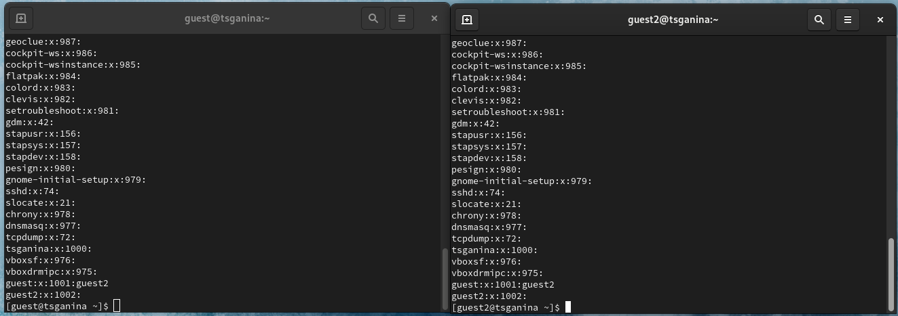

---
## Front matter
lang: ru-RU
title: "Лабораторная работа №3. Дискреционное разграничение прав в Linux. Два пользователя"
subtitle: "Дисциплина: Основы информационной безопасности"
author:
  - Ганина Т. С.
institute:
  - Группа НКАбд-01-22
  - Российский университет дружбы народов, Москва, Россия
date: 10 марта 2024

## i18n babel
babel-lang: russian
babel-otherlangs: english

## Formatting pdf
toc: false
toc-title: Содержание
slide_level: 2
aspectratio: 169
section-titles: true
theme: metropolis
header-includes:
 - \metroset{progressbar=frametitle,sectionpage=progressbar,numbering=fraction}
 - '\makeatletter'
 - '\beamer@ignorenonframefalse'
 - '\makeatother'
---

# Информация

## Докладчик

:::::::::::::: {.columns align=center}
::: {.column width="70%"}

  * Ганина Таисия
  * Студентка 2 курса, НКАбд-01-22
  * Направление "Компьютерные и информационные науки"
  * Российский университет дружбы народов
  * [Гитхаб](https://github.com/tsganina/study_2023-2024_infosec)
  * <https://tsganina.github.io/>

:::
::: {.column width="30%"}

:::
::::::::::::::

# Вводная часть

## Объект и предмет исследования

- Работа с атрибутами файлов
- Права различных групп пользователей

## Цели и задачи

Получение практических навыков работы в консоли с атрибутами файлов, закрепление теоретических основ дискреционного разграничения доступа в современных системах с открытым кодом на базе ОС Linux.

# Выполнение лабораторной работы

## Создание нового пользователя, задание пароля

{#fig:001 width=70%}

## Вхожу в систему от двух пользователей на двух разных консолях. Уточнаяю имя пользователя, его группу

{#fig:002 width=70%}

##

{#fig:003 width=70%}

##

{#fig:004 width=70%}

## От имени пользователя guest2 выполняю регистрацию пользователя guest2 в группе guest

{#fig:005 width=70%}

## От имени пользователя guest меняю права директории, разрешая все действия для пользователей группы.

{#fig:006 width=70%}

## От имени пользователя guest снимаю с директории dir1 все атрибуты

{#fig:007 width=70%}

# Результаты

## Вывод

Были получены практические навыки работы в консоли с атрибутами файлов, закрепление теоретических основ дискреционного разграничения доступа в современных системах с открытым кодом на базе ОС Linux.

