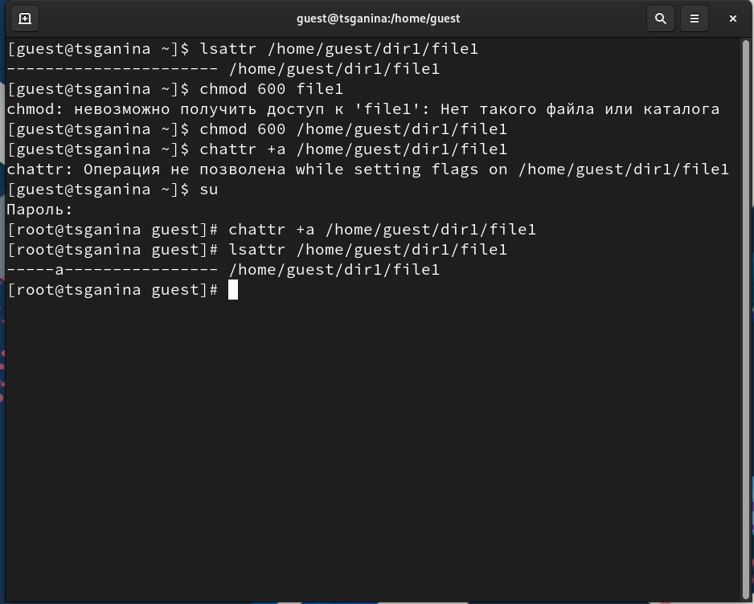
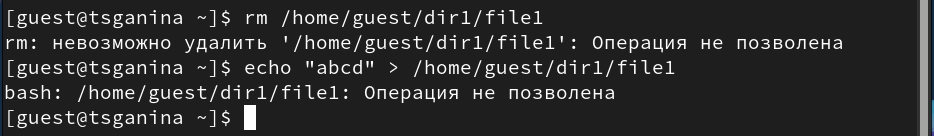
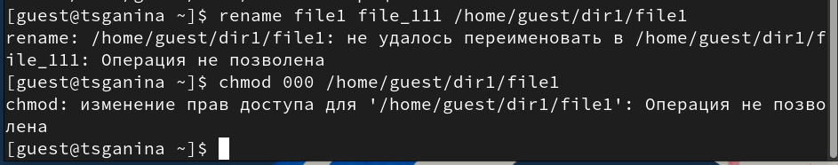
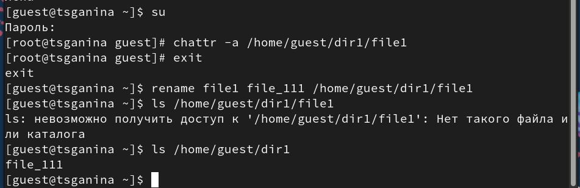
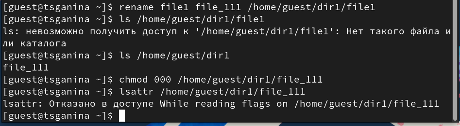
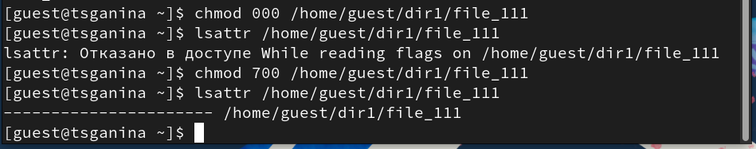
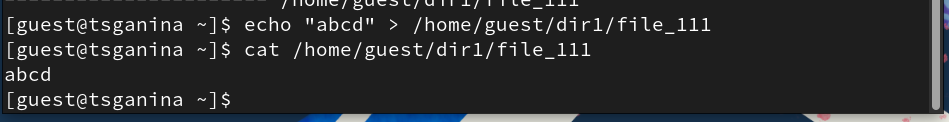
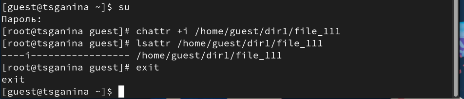
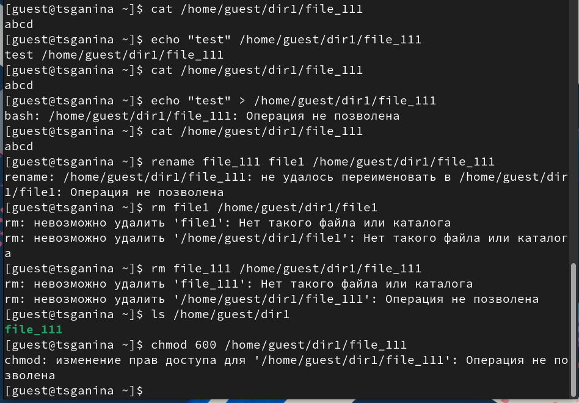

---
## Front matter
lang: ru-RU
title: "Лабораторная работа №4. Дискреционное разграничение прав в Linux. Расширенные атрибуты"
subtitle: "Дисциплина: Основы информационной безопасности"
author:
  - Ганина Т. С.
institute:
  - Группа НКАбд-01-22
  - Российский университет дружбы народов, Москва, Россия
date: 30 марта 2024

## i18n babel
babel-lang: russian
babel-otherlangs: english

## Formatting pdf
toc: false
toc-title: Содержание
slide_level: 2
aspectratio: 169
section-titles: true
theme: metropolis
header-includes:
 - \metroset{progressbar=frametitle,sectionpage=progressbar,numbering=fraction}
 - '\makeatletter'
 - '\beamer@ignorenonframefalse'
 - '\makeatother'
---

# Информация

## Докладчик

:::::::::::::: {.columns align=center}
::: {.column width="70%"}

  * Ганина Таисия
  * Студентка 2 курса, НКАбд-01-22
  * Направление "Компьютерные и информационные науки"
  * Российский университет дружбы народов
  * [Гитхаб](https://github.com/tsganina/study_2023-2024_infosec)
  * <https://tsganina.github.io/>

:::
::: {.column width="30%"}

:::
::::::::::::::

# Вводная часть

## Объект и предмет исследования

- Работа с атрибутами файлов

## Цели и задачи

Получение практических навыков работы в консоли с атрибутами файлов, закрепление теоретических основ дискреционного разграничения доступа в современных системах с открытым кодом на базе ОС Linux.

# Выполнение лабораторной работы

## Задания 1-5

{#fig:001 width=70%}

## Попробовала удалить файл file1 либо стереть имеющуюся в нём информацию

{#fig:003 width=70%}

## Попробовала переименовать файл, установить на файл file1 права, например, запрещающие чтение и запись для владельца файла. Сделать это не удалось.

{#fig:004 width=70%}

## Сняла расширенный атрибут a с файла /home/guest/dirl/file1 от имени суперпользователя. Повторила операции, которые ранее не удавалось выполнить.

{#fig:005 width=70%}

##

{#fig:006 width=70%}

##

{#fig:007 width=70%}

##

{#fig:008 width=70%}

## Повторила действия по шагам, заменив атрибут «a» атрибутом «i». Удалось ли дозаписать информацию в файл? Нет.

{#fig:009 width=70%}

##

{#fig:010 width=70%}

# Результаты

## Вывод

Были получены практические навыки работы в консоли с расширенными атрибутами файлов.

