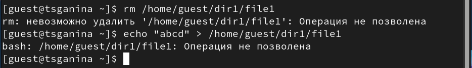
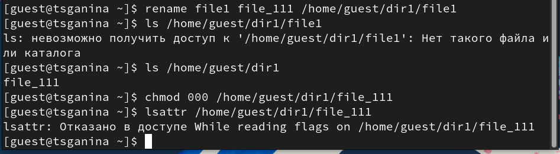
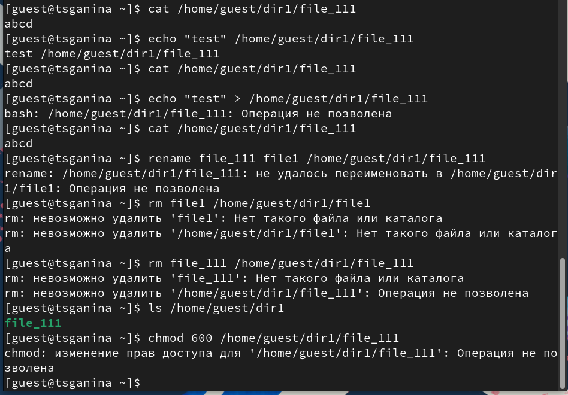

---
## Front matter
title: "Отчёт по лабораторной работе №4. Информационная безопасность"
subtitle: "Дискреционное разграничение прав в Linux. Расширенные атрибуты"
author: "Ганина Таисия Сергеевна, НКАбд-01-22"

## Generic otions
lang: ru-RU
toc-title: "Содержание"

## Bibliography
bibliography: bib/cite.bib
csl: pandoc/csl/gost-r-7-0-5-2008-numeric.csl

## Pdf output format
toc: true # Table of contents
toc-depth: 2
lof: true # List of figures
lot: true # List of tables
fontsize: 12pt
linestretch: 1.5
papersize: a4
documentclass: scrreprt
## I18n polyglossia
polyglossia-lang:
  name: russian
  options:
	- spelling=modern
	- babelshorthands=true
polyglossia-otherlangs:
  name: english
## I18n babel
babel-lang: russian
babel-otherlangs: english
## Fonts
mainfont: PT Serif
romanfont: PT Serif
sansfont: PT Sans
monofont: PT Mono
mainfontoptions: Ligatures=TeX
romanfontoptions: Ligatures=TeX
sansfontoptions: Ligatures=TeX,Scale=MatchLowercase
monofontoptions: Scale=MatchLowercase,Scale=0.9
## Biblatex
biblatex: true
biblio-style: "gost-numeric"
biblatexoptions:
  - parentracker=true
  - backend=biber
  - hyperref=auto
  - language=auto
  - autolang=other*
  - citestyle=gost-numeric
## Pandoc-crossref LaTeX customization
figureTitle: "Рис."
tableTitle: "Таблица"
listingTitle: "Листинг"
lofTitle: "Список иллюстраций"
lotTitle: "Список таблиц"
lolTitle: "Листинги"
## Misc options
indent: true
header-includes:
  - \usepackage{indentfirst}
  - \usepackage{float} # keep figures where there are in the text
  - \floatplacement{figure}{H} # keep figures where there are in the text
---

# Цель работы

Получение практических навыков работы в консоли с расширенными
атрибутами файлов.

# Задание

1. От имени пользователя guest определите расширенные атрибуты файла
/home/guest/dir1/file1 командой
lsattr /home/guest/dir1/file1
2. Установите командой chmod 600 file1 на файл file1 права, разрешающие чтение и запись для владельца файла.
3. Попробуйте установить на файл /home/guest/dir1/file1 расширенный атрибут a от имени пользователя guest: chattr +a /home/guest/dir1/file1 

В ответ вы должны получить отказ от выполнения операции.

4. Зайдите на третью консоль с правами администратора либо повысьте
свои права с помощью команды su. Попробуйте установить расширенный атрибут a на файл /home/guest/dir1/file1 от имени суперпользователя:
chattr +a /home/guest/dir1/file1

5. От пользователя guest проверьте правильность установления атрибута:
lsattr /home/guest/dir1/file1

6. Выполните дозапись в файл file1 слова «test» командой echo "test" /home/guest/dir1/file1
После этого выполните чтение файла file1 командой cat /home/guest/dir1/file1
Убедитесь, что слово test было успешно записано в file1.

7. Попробуйте удалить файл file1 либо стереть имеющуюся в нём информацию командой echo "abcd" > /home/guest/dirl/file1
Попробуйте переименовать файл.

8. Попробуйте с помощью команды chmod 000 file1 установить на файл file1 права, например, запрещающие чтение и запись для владельца файла. Удалось ли вам успешно выполнить указанные команды?
9. Снимите расширенный атрибут a с файла /home/guest/dirl/file1 от имени суперпользователя командой chattr -a /home/guest/dir1/file1

Повторите операции, которые вам ранее не удавалось выполнить. Ваши наблюдения занесите в отчёт.

10. Повторите ваши действия по шагам, заменив атрибут «a» атрибутом «i».
Удалось ли вам дозаписать информацию в файл? Ваши наблюдения за несите в отчёт.

# Теоретическое введение

**Права доступа** определяют, какие действия конкретный пользователь может или не может совершать с определенным файлами и каталогами. С помощью разрешений можно создать надежную среду — такую, в которой никто не может поменять содержимое ваших документов или повредить системные файлы. [1]

**Расширенные атрибуты файлов Linux** представляют собой пары имя:значение, которые постоянно связаны с файлами и каталогами, подобно тому как строки окружения связаны с процессом. Атрибут может быть определён или не определён. Если он определён, то его значение может быть или пустым, или не пустым. [2]

Расширенные атрибуты дополняют обычные атрибуты, которые связаны со всеми inode в файловой системе (т. е., данные stat(2)). Часто они используются для предоставления дополнительных возможностей файловой системы, например, дополнительные возможности безопасности, такие как списки контроля доступа (ACL), могут быть реализованы через расширенные атрибуты. [3]

*Установить атрибуты:*

- chattr filename

*Значения:*

- chattr +a # только добавление. Удаление и переименование запрещено;

- chattr +A # не фиксировать данные об обращении к файлу

- chattr +c # сжатый файл

- chattr +d # неархивируемый файл

- chattr +i # неизменяемый файл

- chattr +S # синхронное обновление

- chattr +s # безопасное удаление, (после удаления место на диске переписывается нулями)

- chattr +u # неудаляемый файл

- chattr -R # рекурсия

*Просмотреть атрибуты:*

- lsattr filename

*Опции:*

- lsattr -R # рекурсия

- lsattr -a # вывести все файлы (включая скрытые)

- lsattr -d # не выводить содержимое директории

# Выполнение лабораторной работы

1. Задания 1-5 (рис. @fig:001).

{#fig:001 width=70%}

2. Выполнила дозапись в файл file1 слова «test» командой (рис. @fig:002).

{#fig:002 width=70%}

3. Попробовала удалить файл file1 либо стереть имеющуюся в нём информацию (рис. @fig:003).

{#fig:003 width=70%}

4. Попробовала переименовать файл, установить на файл file1 права, например, запрещающие чтение и запись для владельца файла. Сделать это не удалось. (рис. @fig:004)

{#fig:004 width=70%}

5. Сняла расширенный атрибут a с файла /home/guest/dirl/file1 от имени суперпользователя. Повторила операции, которые ранее не удавалось выполнить. (рис. @fig:005, @fig:006, @fig:007, @fig:008)

{#fig:005 width=70%}

{#fig:006 width=70%}

{#fig:007 width=70%}

{#fig:008 width=70%}

6. Повторила действия по шагам, заменив атрибут «a» атрибутом «i».
Удалось ли дозаписать информацию в файл? Нет. (рис. @fig:009, @fig:010)

{#fig:009 width=70%}

{#fig:010 width=70%}

# Выводы

Были получены практические навыки работы в консоли с расширенными атрибутами файлов.

# Список литературы{.unnumbered}

[0] Методические материалы курса

[1] Права доступа: https://codechick.io/tutorials/unix-linux/unix-linux-permissions

[2] Расширенные атрибуты: https://ru.manpages.org/xattr/7

[3] Операции с расширенными атрибутами: https://p-n-z-8-8.livejournal.com/64493.html

::: {#refs}
:::
