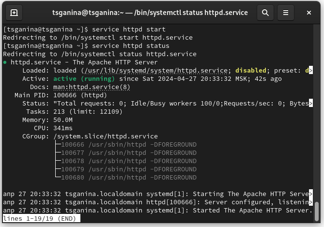
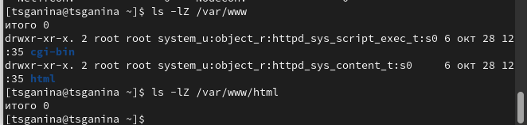
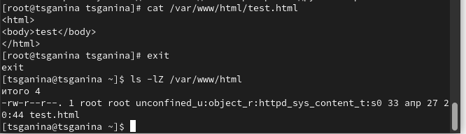
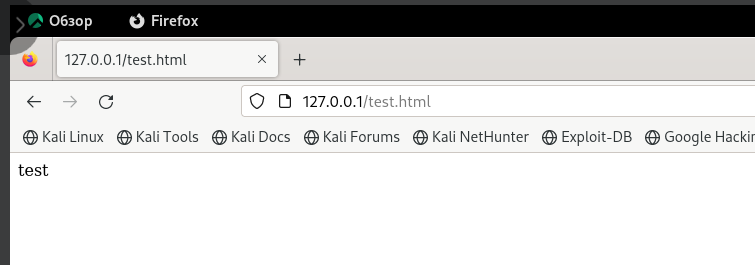
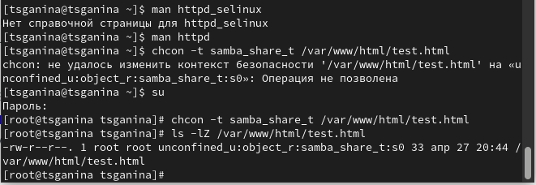
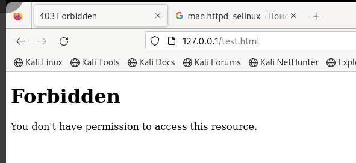
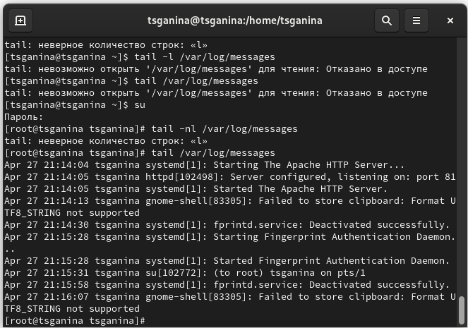
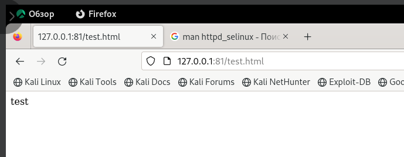
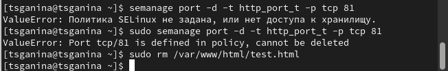

---
## Front matter
lang: ru-RU
title: "Лабораторная работа №6. Мандатное разграничение прав в Linux"
subtitle: "Дисциплина: Основы информационной безопасности"
author:
  - Ганина Т. С.
institute:
  - Группа НКАбд-01-22
  - Российский университет дружбы народов, Москва, Россия
date: 27 апреля 2024

## i18n babel
babel-lang: russian
babel-otherlangs: english

## Formatting pdf
toc: false
toc-title: Содержание
slide_level: 2
aspectratio: 169
section-titles: true
theme: metropolis
header-includes:
 - \metroset{progressbar=frametitle,sectionpage=progressbar,numbering=fraction}
 - '\makeatletter'
 - '\beamer@ignorenonframefalse'
 - '\makeatother'
---

# Информация

## Докладчик

:::::::::::::: {.columns align=center}
::: {.column width="70%"}

  * Ганина Таисия
  * Студентка 2 курса, НКАбд-01-22
  * Направление "Компьютерные и информационные науки"
  * Российский университет дружбы народов
  * [Гитхаб](https://github.com/tsganina/study_2023-2024_infosec)
  * <https://tsganina.github.io/>

:::
::: {.column width="30%"}

:::
::::::::::::::

# Вводная часть

## Объект и предмет исследования

- Работа с атрибутами файлов

## Цели и задачи

Развить навыки администрирования ОС Linux. Получить первое практическое знакомство с технологией SELinux1. Проверить работу SELinx на практике совместно с веб-сервером Apache.

# Выполнение лабораторной работы

## Обратились с помощью браузера к веб-серверу, запущенному на  компьютере, и убедились, что последний работает с помощью команды “service httpd status” 

{ #fig:002 width=70%}

## С помощью команды “ls -lZ /var/www” посмотрели файлы и поддиректории, находящиеся в директории /var/www

{ #fig:006 width=70%}

## От имени суперпользователя создали html-файл /var/www/html/test.html. Контекст созданного файла - httpd_sys_content_t

{ #fig:007 width=70% height=70%}

## Обратились к файлу через веб-сервер, введя в браузере адрес “http://127.0.0.1/test.html”. Файл был успешно отображен

{#fig:008 width=70%}

##

{ #fig:009 width=70% height=70% }

## Попробовали еще раз получить доступ к файлу через веб-сервер, введя в браузере адрес “http://127.0.0.1/test.html” и получили сообщение об ошибке (т.к. к установленному ранее контексту процесс httpd не имеет доступа)

{ #fig:010 width=70% height=70% }

## Просмотрели системный лог-файл веб-сервера Apache командой “sudo tail /var/log/messages”, отображающий ошибки

{ #fig:011 width=70% height=70% }

## Вернули контекст “httpd_sys_cоntent_t” файлу “/var/www/html/test.html” командой “chcon -t httpd_sys_content_t /var/www/html/test.html” и после этого попробовали получить доступ к файлу через веб-сервер, введя адрес “http://127.0.0.1:81/test.html”, в результате чего увидели содежимое файла - слово “test”

{ #fig:012 width=70% height=70% }

## Удалили файл “/var/www/html/test.html” командой “rm /var/www/html/test.html”

{ #fig:013 width=70% height=70% }

# Результаты

## Вывод

В ходе выполнения данной лабораторной работы были развиты навыки администрирования ОС Linux, получено первое практическое знакомство с технологией SELinux и проверена работа SELinux на практике совместно с веб-сервером Apache.
