---
## Front matter
title: "Отчёт по лабораторной работе №6, Основы информационной безопасности"
subtitle: "Мандатное разграничение прав в Linux"
author: "Ганина Таисия Сергеевна, НКАбд-01-22"

## Generic otions
lang: ru-RU
toc-title: "Содержание"

## Bibliography
bibliography: bib/cite.bib
csl: pandoc/csl/gost-r-7-0-5-2008-numeric.csl

## Pdf output format
toc: true # Table of contents
toc-depth: 2
lof: true # List of figures
fontsize: 12pt
linestretch: 1.5
papersize: a4
documentclass: scrreprt
## I18n polyglossia
polyglossia-lang:
  name: russian
  options:
	- spelling=modern
	- babelshorthands=true
polyglossia-otherlangs:
  name: english
## I18n babel
babel-lang: russian
babel-otherlangs: english
## Fonts
mainfont: PT Serif
romanfont: PT Serif
sansfont: PT Sans
monofont: PT Mono
mainfontoptions: Ligatures=TeX
romanfontoptions: Ligatures=TeX
sansfontoptions: Ligatures=TeX,Scale=MatchLowercase
monofontoptions: Scale=MatchLowercase,Scale=0.9
## Biblatex
biblatex: true
biblio-style: "gost-numeric"
biblatexoptions:
  - parentracker=true
  - backend=biber
  - hyperref=auto
  - language=auto
  - autolang=other*
  - citestyle=gost-numeric
## Pandoc-crossref LaTeX customization
figureTitle: "Рис."
tableTitle: "Таблица"
listingTitle: "Листинг"
lofTitle: "Список иллюстраций"
lolTitle: "Листинги"
## Misc options
indent: true
header-includes:
  - \usepackage{indentfirst}
  - \usepackage{float} # keep figures where there are in the text
  - \floatplacement{figure}{H} # keep figures where there are in the text
---

# Цель работы

Развить навыки администрирования ОС Linux. Получить первое практическое знакомство с технологией SELinux1. Проверить работу SELinx на практике совместно с веб-сервером Apache.

# Теоретическое введение

1. **SELinux (Security-Enhanced Linux)** обеспечивает усиление защиты путем внесения изменений как на уровне ядра, так и на уровне пространства пользователя,
что превращает ее в действительно «непробиваемую» операционную систему.
Впервые эта система появилась в четвертой версии CentOS, а в 5 и 6 версии
реализация была существенно дополнена и улучшена.

*SELinux имеет три основных режим работы:*

- Enforcing: режим по умолчанию. При выборе этого режима все действия, которые каким-то образом нарушают текущую политику безопасности, будут блокироваться, а попытка нарушения будет зафиксирована в журнале.

- Permissive: в случае использования этого режима, информация о всех действиях, которые нарушают текущую политику безопасности, будут зафиксированы в журнале, но сами действия не будут заблокированы.

- Disabled: полное отключение системы принудительного контроля доступа.

Политика SELinux определяет доступ пользователей к ролям, доступ ролей к доменам и доступ доменов к типам.
Контекст безопасности — все атрибуты SELinux — роли, типы и домены.
Более подробно см. в [1].

2. **Apache** — это свободное программное обеспечение, с помощью которого можно создать веб-сервер. Данный продукт возник как доработанная версия другого HTTP-клиента от национального центра суперкомпьютерных приложений
(NCSA).

*Для чего нужен Apache сервер:*

- чтобы открывать динамические PHP-страницы,

- для распределения поступающей на сервер нагрузки,

- для обеспечения отказоустойчивости сервера,

- чтобы потренироваться в настройке сервера и запуске PHP-скриптов.

Apache является кроссплатформенным ПО и поддерживает такие операционные системы, как Linux, BSD, MacOS, Microsoft, BeOS и другие.

Более подробно см. в [2].

# Выполнение лабораторной работы

Вошли в систему под своей учетной записью и убедились, что SELinux работает в режиме enforcing политики targeted с помощью команд “getenforce” и “sestatus”
(@fig:001)

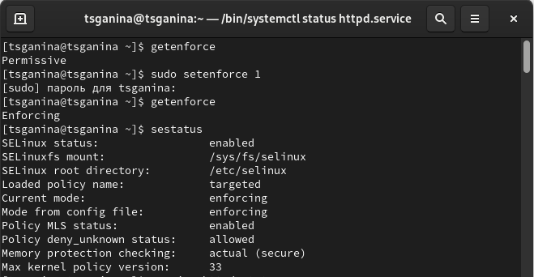{#fig:001 width=70%}

Обратились с помощью браузера к веб-серверу, запущенному на  компьютере, и убедились, что последний работает с помощью команды “service httpd status” (@fig:002)

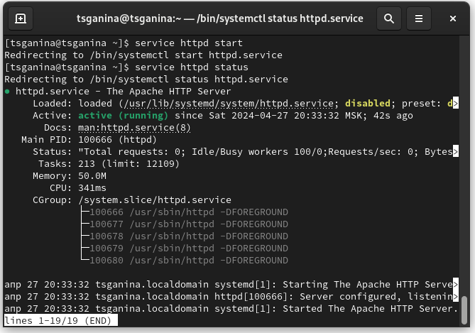{ #fig:002 width=70%}

С помощью команды “ps auxZ | grep httpd” определили контекст безопасности веб-сервера Apache - httpd_t (@fig:003)

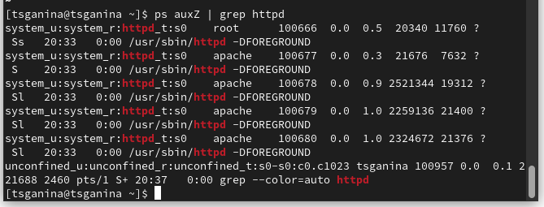{#fig:003 width=70%}

Посмотрели текущее состояние переключателей SELinux для Apache с помощью команды “sestatus -b httpd”, многие из переключателей находятся в положении “off” (@fig:004)

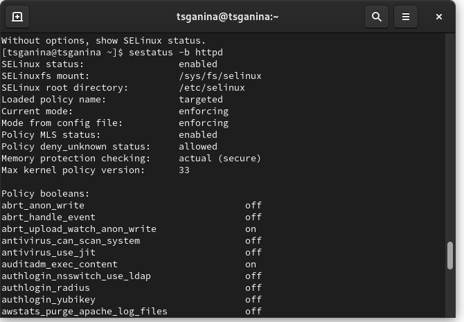{ #fig:004 width=70%}

Посмотрели статистику по политике с помощью команды “seinfo”. Множество пользователей - 8, ролей - 15, типов 5135 (@fig:005)

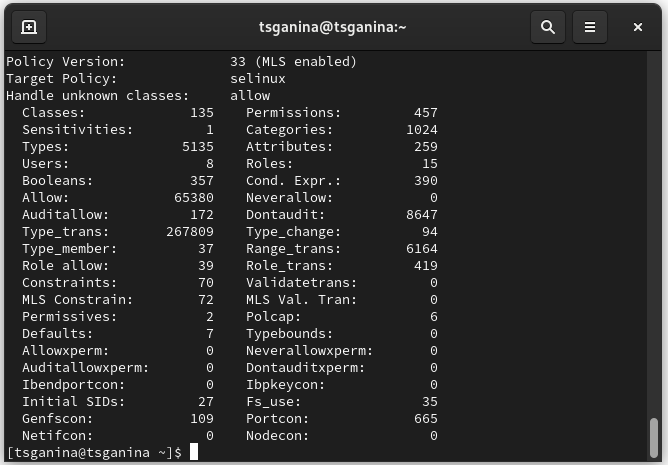{#fig:005 width=70%}

С помощью команды “ls -lZ /var/www” посмотрели файлы и поддиректории, находящиеся в директории /var/www. Используя команду “ls -lZ /var/www/html”, определили, что в данной директории файлов нет. Только владелец/суперпользователь может создавать файлы в директории /var/www/html (@fig:006)

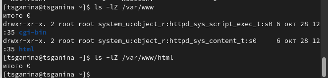{ #fig:006 width=70%}

От имени суперпользователя создали html-файл /var/www/html/test.html. Контекст созданного файла - httpd_sys_content_t (@fig:007)

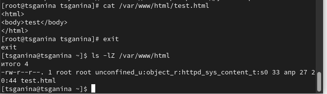{ #fig:007 width=70% height=70%}

Обратились к файлу через веб-сервер, введя в браузере адрес “http://127.0.0.1/test.html”. Файл был успешно отображен (@fig:008)

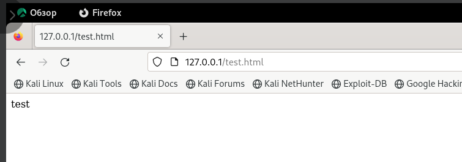{#fig:008 width=70%}

Изучив справку man httpd_selinux, выяснили, что для httpd определены следующие контексты файлов: 

httpd_sys_content_t, httpd_sys_script_exec_t,

httpd_sys_script_ro_t, httpd_sys_script_rw_t, 

httpd_sys_script_ra_t, httpd_unconfined_script_exec_t.

Контекст моего файла - httpd_sys_content_t (в таком случае содержимое должно быть доступно для всех скриптов httpd и для самого демона). Изменили контекст файла на samba_share_t командой “sudo chcon -t samba_share_t/var/www/html/test.html” и проверили, что контекст поменялся (@fig:009)

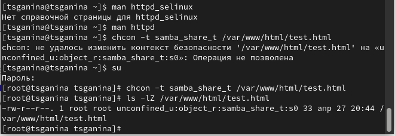{ #fig:009 width=70% height=70% }

Попробовали еще раз получить доступ к файлу через веб-сервер, введя в браузере адрес “http://127.0.0.1/test.html” и получили сообщение об ошибке (т.к. к
установленному ранее контексту процесс httpd не имеет доступа) (@fig:010)

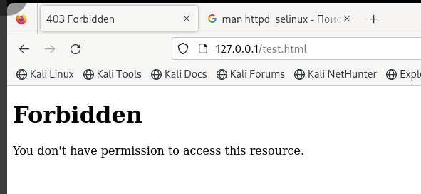{ #fig:010 width=70% height=70% }

Просмотрели системный лог-файл веб-сервера Apache командой “sudo tail /var/log/messages”, отображающий ошибки (@fig:011)

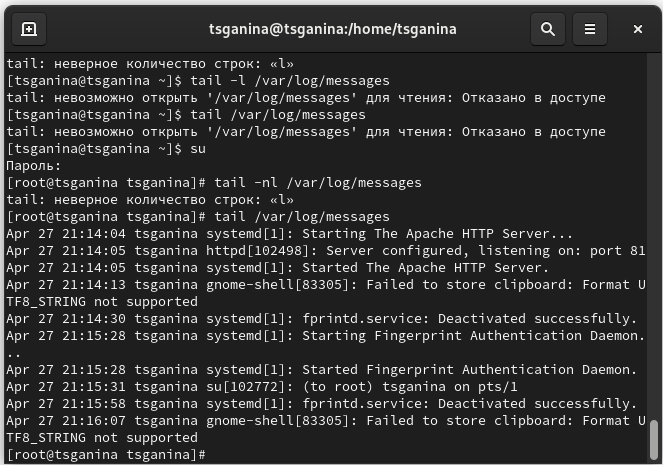{ #fig:011 width=70% height=70% }

В файле /etc/httpd/conf/httpd.conf заменили строчку “Listen 80” на “Listen 81”, чтобы установить веб-сервер Apache на прослушивание TCP-порта 81

Перезапускаем веб-сервер Apache и анализируем лог-файлы командой “tail -nl /var/log/messages”

Просмотрели файлы “var/log/http/error_log”, “/var/log/http/access_log” и "/var/log/audit/audit.log” и выяснили, что запись появилась в последнем файле

Выполнили команду “semanage port -a -t http_port_t -р tcp 81” и убедились, что порт TCP-81 установлен. Проверили список портов командой “semanage port -l | grep http_port_t”, убедились, что порт 81 есть в списке и запускаем веб-сервер Apache снова.

Вернули контекст “httpd_sys_cоntent_t” файлу “/var/www/html/test.html” командой “chcon -t httpd_sys_content_t /var/www/html/test.html” и после этого попробовали получить доступ к файлу через веб-сервер, введя адрес “http://127.0.0.1:81/test.html”, в результате чего увидели содежимое файла - слово “test” (@fig:012)

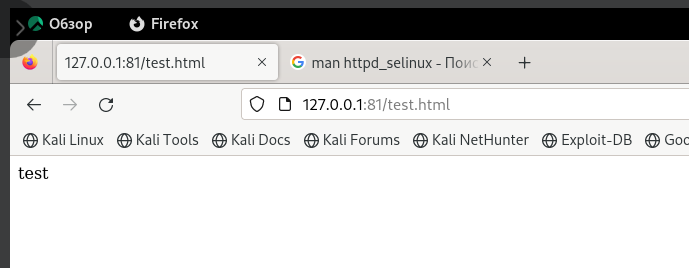{ #fig:012 width=70% height=70% }

Исправили обратно конфигурационный файл apache, вернув “Listen 80”. Попытались удалить привязку http_port к 81 порту командой “semanage port -d -t http_port_t -p tcp 81”, но этот порт определен на уровне политики, поэтому его нельзя удалить 

Удалили файл “/var/www/html/test.html” командой “rm /var/www/html/test.html” (@fig:013)

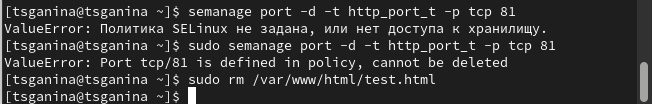{ #fig:013 width=70% height=70% }

# Вывод

В ходе выполнения данной лабораторной работы были развиты навыки администрирования ОС Linux, получено первое практическое знакомство с технологией SELinux и проверена работа SELinux на практике совместно с веб-сервером
Apache.

# Список литературы. Библиография

[0] Методические материалы курса

[1] SELinux: https://habr.com/ru/companies/kingservers/articles/209644/

[2] Apache: https://2domains.ru/support/vps-i-servery/shto-takoye-apache
