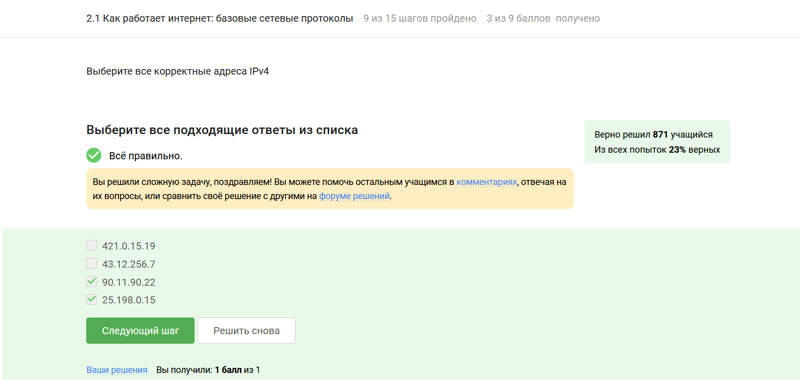
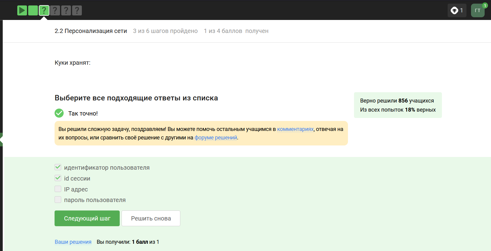
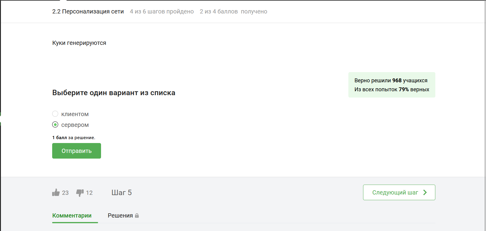
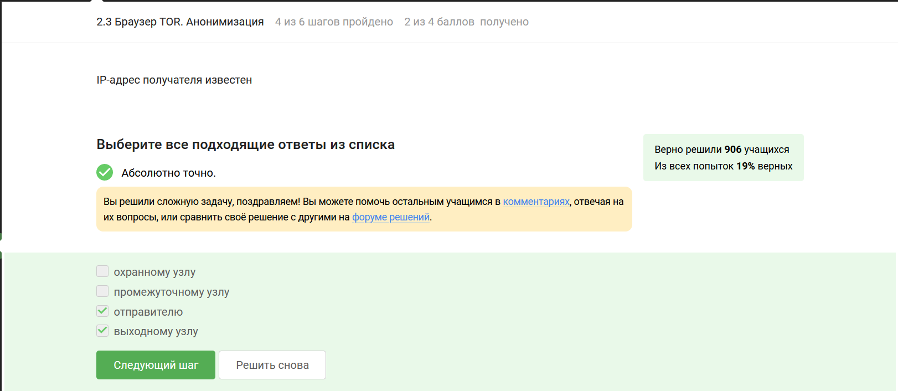
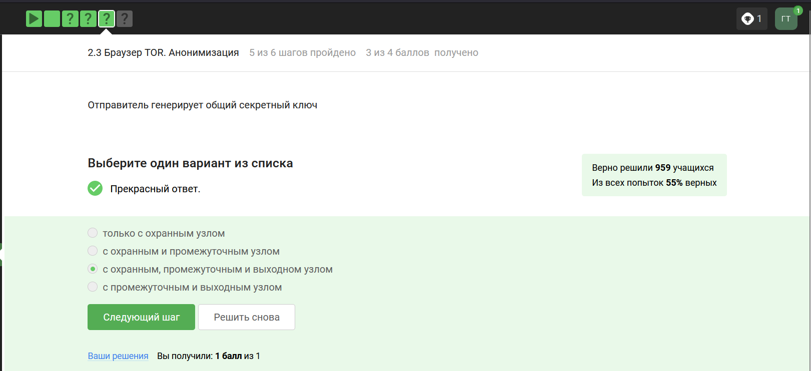
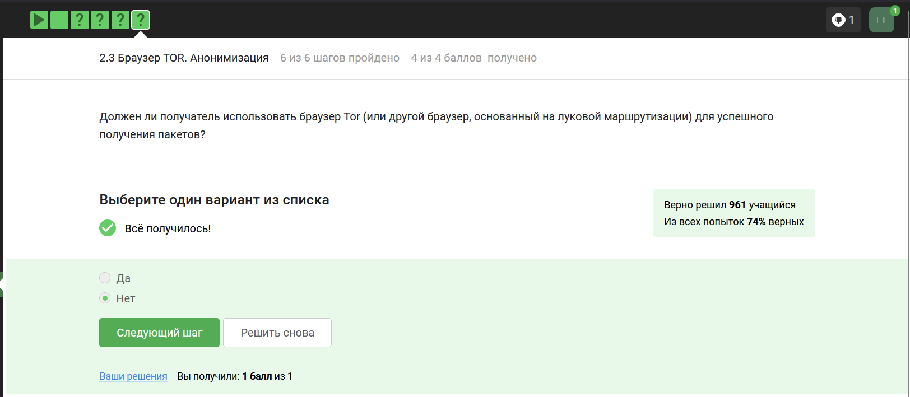
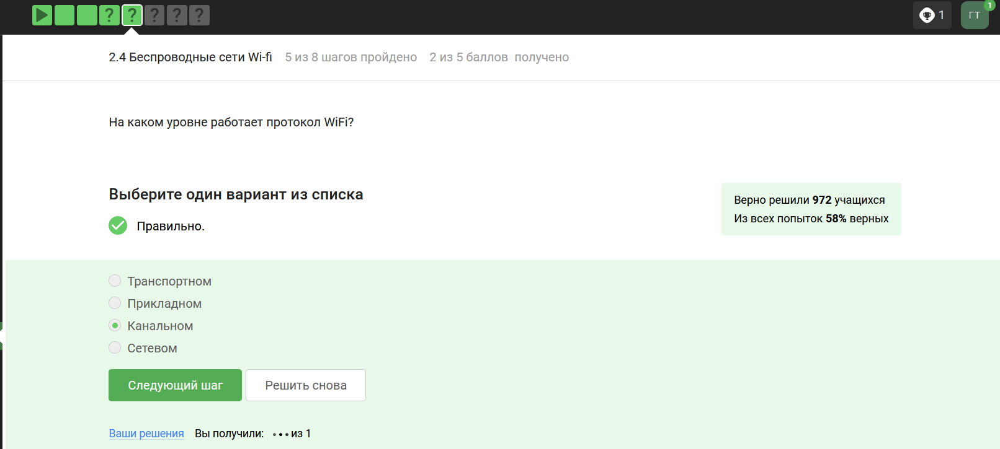

---
## Front matter
title: "Отчет о первом модуле внешнего курса"
subtitle: "Безопасность в сети"
author: "Ганина Таисия Сергеевна"

## Generic otions
lang: ru-RU
toc-title: "Содержание"

## Bibliography
bibliography: bib/cite.bib
csl: pandoc/csl/gost-r-7-0-5-2008-numeric.csl

## Pdf output format
toc: true # Table of contents
toc-depth: 2
lof: true # List of figures
lot: true # List of tables
fontsize: 12pt
linestretch: 1.5
papersize: a4
documentclass: scrreprt
## I18n polyglossia
polyglossia-lang:
  name: russian
  options:
	- spelling=modern
	- babelshorthands=true
polyglossia-otherlangs:
  name: english
## I18n babel
babel-lang: russian
babel-otherlangs: english
## Fonts
mainfont: PT Serif
romanfont: PT Serif
sansfont: PT Sans
monofont: PT Mono
mainfontoptions: Ligatures=TeX
romanfontoptions: Ligatures=TeX
sansfontoptions: Ligatures=TeX,Scale=MatchLowercase
monofontoptions: Scale=MatchLowercase,Scale=0.9
## Biblatex
biblatex: true
biblio-style: "gost-numeric"
biblatexoptions:
  - parentracker=true
  - backend=biber
  - hyperref=auto
  - language=auto
  - autolang=other*
  - citestyle=gost-numeric
## Pandoc-crossref LaTeX customization
figureTitle: "Рис."
tableTitle: "Таблица"
listingTitle: "Листинг"
lofTitle: "Список иллюстраций"
lotTitle: "Список таблиц"
lolTitle: "Листинги"
## Misc options
indent: true
header-includes:
  - \usepackage{indentfirst}
  - \usepackage{float} # keep figures where there are in the text
  - \floatplacement{figure}{H} # keep figures where there are in the text
---

# Выполнение заданий модуля

Выполнение заданий. (рис. @fig:001, @fig:002, @fig:003, @fig:004, @fig:005, @fig:006, @fig:007, @fig:008, @fig:009, @fig:010, @fig:011, @fig:012, @fig:013, @fig:014, @fig:015, @fig:016, @fig:017, @fig:018, @fig:019, @fig:020, @fig:021).

{#fig:001 width=70%}

Например, браузеры и веб-страницы используют протокол HTTP или его современную версию HTTPS. Ни для кого не секрет, что URL странички начинается с HTTP или HTTPS. S означает, что мы общаемся с веб-страницей по зашифрованному каналу. И более подробно мы рассмотрим протокол HTTPS в следующей лекции. Вообще, протокол HTTP(S) является примером протокола прикладного уровня, по которому передаются веб-страницы. 

{#fig:002 width=70%}

Все эти протоколы прикладного уровня работают над транспортным уровнем, это следующий уровень в модели TCP/IP. Транспортный уровень обеспечивает передачу данных между процессами на одной машине или хосте (host).

{#fig:003 width=70%}

Существуют две версии адресации в протоколе IP. Популярный на сегодняшний день - это версия 4 адресации (IPv4), и этот адрес состоит из большего набора чисел, нежели порт в TCP протоколе, а именно это 4 числа от 0 до 255. Например, адрес IPv4 может выглядеть вот так: 192.168.1.4. Первые три числа - это номер сети. Если продолжать сравнение с почтовым адресом дома, то это по сути индекс и название улицы. Последняя цифра 4 - это номер хоста или номер дома. Хост - это, например, то устройство, которое раздает мне интернет, то есть мой роутер. Не всегда номер хоста - это последняя цифра из четырёх. Иногда, как правило, в больших сетях, корпоративных сетях, больше машин, больше компьютеров подключено к сети, нежели 255, тогда номер хоста в этой сети занимает еще и вторую справа цифру, то есть в нашем случае единичку. Определяет, где у нас в адресе есть номер сети, а где у нас номер хоста, маска сети. Это еще один номер, который добавляется к адресу IPv4, это просто указатель того, где происходит разделение между номером сети и номером хоста. 

{#fig:004 width=70%}

Вопрос: откуда сеть знать, что, например, yandex.ru лежит по такому IP-адресу как 77.88.55.77? Для этого в сети есть сервер DNS, от английского Domain Name Server, а по-русски это сервер доменных имен. Доменное имя - это как раз таки то, что мы называем ссылкой - yandex.ru, google.com, mail.ru и так далее. 

{#fig:005 width=70%}

Важно помнить, что работа сети Интернет описывается моделью TCP/IP, где TCP и IP - это название двух основных протоколов в Интернете. Он состоит из четырех различных уровней: это прикладной, транспортный, сетевой и канальный. 

{#fig:006 width=70%}

Браузеры и веб-страницы используют протокол HTTP или его современную версию HTTPS. Ни для кого не секрет, что URL странички начинается с HTTP или HTTPS. S означает, что мы общаемся с веб-страницей по зашифрованному каналу. 

{#fig:007 width=70%}

{#fig:008 width=70%}

{#fig:009 width=70%}

Так вот, куки - это данные, которые передаются от сервера клиенту для его идентификации. Так, например, они сохраняют сессионную информацию. Куки, как правило, хранят в себе список параметров и их значений. Этими параметрами могут быть id пользователя, id сессии, иногда описан тип браузера и время запросов и некоторые действия пользователей

{#fig:010 width=70%}

Куки хранят данные сессии и id, чтобы не приходилось, например, логиниться несколько раз подряд при обновлении страницы. Про производительность ничего сказано не было.

{#fig:011 width=70%}

Куки - это данные, которые передаются от сервера клиенту для его идентификации. Мы как пользователи не управляем, какой тип куки используется на конкретном сайте, этим занимается разработчик. То есть решил разработчик Фейсбука, что у него будут постоянные куки со сроком годности 24 часа, они у вас и будут.

{#fig:012 width=70%}

Куки бывают сессионные; как правило, эти cookies используются при навигации на сайте и удаляются при закрытии окна браузера. То есть мы закрыли какое-то окно, интернет-магазин открыли заново - корзина пуста. Это означает, что в этом сайте, на этом сервере cookies куки сессионные. Ещё они бывают постоянные, как правило, они используются при аутентификации. 

{#fig:013 width=70%}

В общем, в итоге отправитель сгенерировал общие ключи с тремя промежуточным узлами. Далее он шифрует свои данные под каждым из этих ключей.

{#fig:014 width=70%}

Соответственно выходной узел, поскольку он является узлом перед получателем, знает, кому направлен пакет. Охранный узел знает, от кого пришёл пакет, поскольку он непосредственно является следующим узлом после отправителя, в то время как промежуточный узел не знает ни от кого этот пакет, ни кому он предназначен. В браузере Tor всегда есть три роутера, их не больше и не меньше. Их не меньше потому, что меньшего числа узлов не хватает для анонимизации, а большее число узлов не дает большую анонимизацию, поэтому выбирается всегда 3 луковых роутера. 

Посмотрим теперь, за счет чего достигается конфиденциальность. Допустим, у нас с вами есть отправитель, мы обозначим его буквой S, и три узла: охранный A, промежуточный B и выходной C. Первым делом алгоритм выбирает выходной узел C, затем два других узла. Это выбирает встроенный алгоритм в вашем браузере, который знает, кому в итоге пакет должен прийти и какие узлы могут доставить ваш пакет тому, куда он должен прийти. Далее отправитель генерирует общие ключи с помощью определенного криптографического алгоритма, того же самого, который используется в TLS-протоколе. Он генерирует общие ключи последовательно с охранным узлом A, далее с промежуточным узлом B, а потом и с выходным узлом C. Вначале он непосредственно генерирует общий ключ KSA, то есть между отправителем S и охранным узлом A, потом охранный узел помогает сгенерировать общий ключ между S и между B, промежуточным узлом. Он перенаправляет данные, которые идут от отправителя к промежуточному узлу. Таким образом, охранный узел не знает, какой ключ между ними сгенерировался, то есть он не знает KSB. Однако он помогает при передаче публичной информации, с помощью которой два узла могут сгенерировать общий ключ. И то же самое с последним выходным узлом, тут уже и A, и B помогают перенаправлять данные в процессе генерации этого ключа. 

{#fig:015 width=70%}

Отправитель генерирует общие ключи с помощью определенного криптографического алгоритма, того же самого, который используется в TLS-протоколе. Он генерирует общие ключи последовательно с охранным узлом A, далее с промежуточным узлом B, а потом и с выходным узлом C. 

{#fig:016 width=70%}

Строго говоря, Tor — это ПО для установки анонимных сетевых соединений, которое использует технологию луковой маршрутизации. Мы можем пользоваться им как отправители, при этом не обязательно, чтобы у получателя тоже стоял тор.

{#fig:017 width=70%}

Вообще, WiFi - это технология беспроводной локальной сети, она основана на стандарте IEEE 802.11. IEEE – это организация, которая описывает вообще любые стандарты того, как работает интернет.

{#fig:018 width=70%}

WiFi работает на самом нижнем канальном уровне, на том же уровне, где работает протокол Ethernet (это протокол, обеспечивающий продвижение данных по проводу).

{#fig:019 width=70%}

Самый ранний и на сегодняшний день небезопасный метод шифрования данных WiFi называется WEP. Он устарел и уже категорически не рекомендуется к использованию. Он устарел, в частности, потому, что использовал малую длину ключа: так, например, он использовал длину ключа в 40 бит, это довольно мало на сегодняшний день, он может быть легко взломан. 

{#fig:020 width=70%}

Безопасность осуществляется на этом уровне с помощью шифрования и аутентификации

{#fig:021 width=70%}

Более современная версия аутентификации WPA3 доступна даже для домашних роутеров, недорогих. Также у WPA3 есть два варианта аутентификации: WPA2 Personal, WPA2 Enterprise. Важная особенность для обычного пользователя в этом методе аутентификации состоит в том, что мы можем брать даже небезопасные пароли такие, как 12345, хотя, конечно, лучше этого не делать, однако в алгоритмах WPA3 есть методы, которые позволяют сделать такой пароль немножко стойким.

::: {#refs}
:::
