---
## Front matter
title: "Отчет о втором модуле внешнего курса"
subtitle: "Защита ПК/телефона"
author: "Ганина Таисия Сергеевна"

## Generic otions
lang: ru-RU
toc-title: "Содержание"

## Bibliography
bibliography: bib/cite.bib
csl: pandoc/csl/gost-r-7-0-5-2008-numeric.csl

## Pdf output format
toc: true # Table of contents
toc-depth: 2
lof: true # List of figures
lot: true # List of tables
fontsize: 12pt
linestretch: 1.5
papersize: a4
documentclass: scrreprt
## I18n polyglossia
polyglossia-lang:
  name: russian
  options:
	- spelling=modern
	- babelshorthands=true
polyglossia-otherlangs:
  name: english
## I18n babel
babel-lang: russian
babel-otherlangs: english
## Fonts
mainfont: PT Serif
romanfont: PT Serif
sansfont: PT Sans
monofont: PT Mono
mainfontoptions: Ligatures=TeX
romanfontoptions: Ligatures=TeX
sansfontoptions: Ligatures=TeX,Scale=MatchLowercase
monofontoptions: Scale=MatchLowercase,Scale=0.9
## Biblatex
biblatex: true
biblio-style: "gost-numeric"
biblatexoptions:
  - parentracker=true
  - backend=biber
  - hyperref=auto
  - language=auto
  - autolang=other*
  - citestyle=gost-numeric
## Pandoc-crossref LaTeX customization
figureTitle: "Рис."
tableTitle: "Таблица"
listingTitle: "Листинг"
lofTitle: "Список иллюстраций"
lotTitle: "Список таблиц"
lolTitle: "Листинги"
## Misc options
indent: true
header-includes:
  - \usepackage{indentfirst}
  - \usepackage{float} # keep figures where there are in the text
  - \floatplacement{figure}{H} # keep figures where there are in the text
---

# Выполнение заданий модуля

Выполнение заданий. (рис. @fig:001, @fig:002, @fig:003, @fig:004, @fig:005, @fig:006, @fig:007, @fig:008, @fig:009, @fig:010, @fig:011, @fig:012, @fig:013, @fig:014, @fig:015).

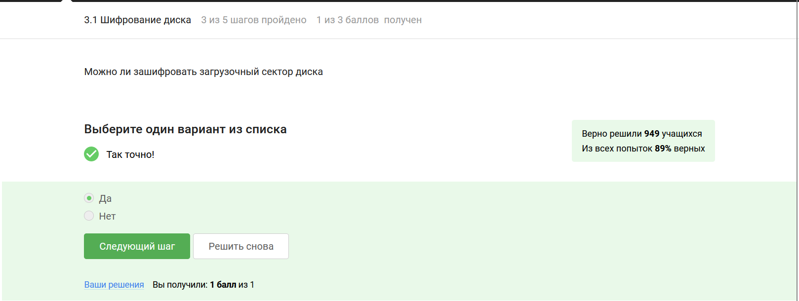{#fig:001 width=70%}

Программа берет этот ключ, берет наши данные, будь то весь жесткий диск или какой-то его сегмент или может быть даже загрузочный сегмент, и шифрует данные с помощью ключа. На выходе мы с вами получаем данные в зашифрованном виде.

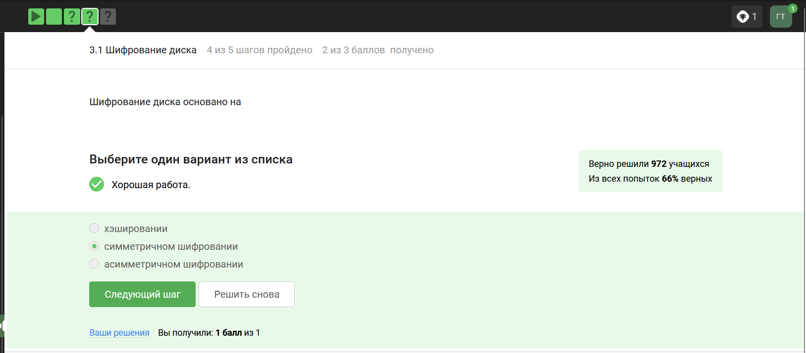{#fig:002 width=70%}

Шифрование больших объемов данных, например, жесткого диска или сегмента жесткого диска или какой-то большой флешки, осуществляется с помощью симметричного шифрования, как правило, алгоритма AES.

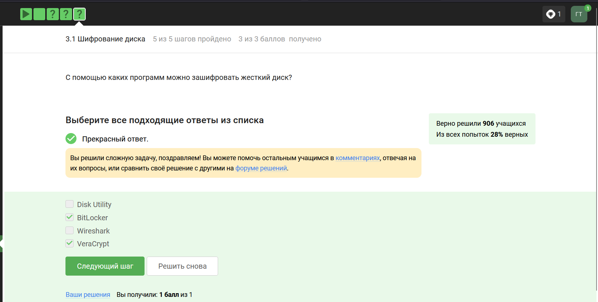{#fig:003 width=70%}

Во всех популярных операционных системах есть встроенные утилиты, которые позволяют шифровать жесткий диск: для Windows этo Bitlocker, в Linux – LUKS, в MacOS – это FileVault. Кроме того, есть и сторонние опенсорсные (open source) программы, то есть бесплатные: это Veracrypt, PGPDisk, которые вы можете установить себе и использовать их для шифрования ваших жестких дисков, загрузочных секторов или флешек. 

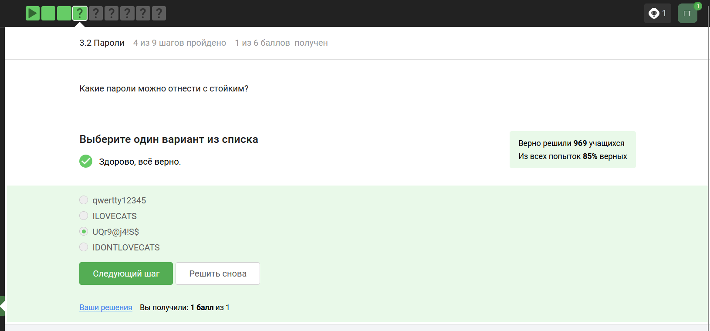{#fig:004 width=70%}

Основной критерий стойкости пароля - это сложность его перебора. 
Наверное, ни для кого не секрет, что пароль 12345, password, qwerty являются самыми частыми. 

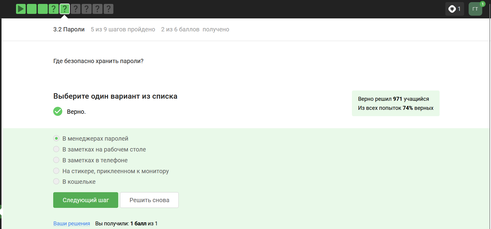{#fig:005 width=70%}

Понятно, что нужно использовать длинные пароли с максимально большим алфавитом, хранить их стоит в менеджерах паролей, пароли нужно менять достаточно регулярно, особенно к таким критическим сервисам, как почта.

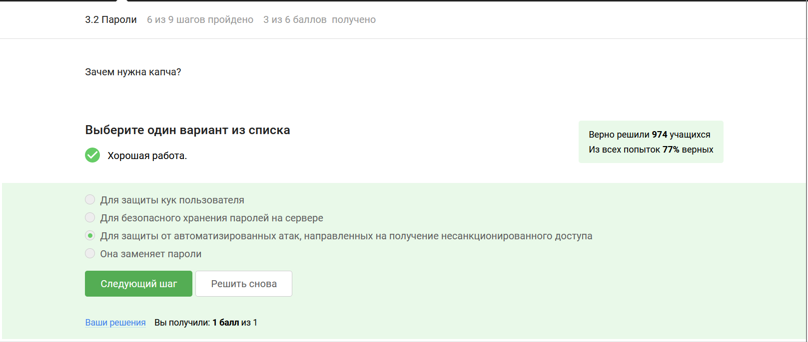{#fig:006 width=70%}

Капча - это аббревиатура с английского; это тест для определения, является ли пользователь, который общается с веб-сервисом, человеком или компьютером, ботом, которой пытается просто-напросто перебрать все пароли. После того, как мы ввели имя пользователя и пароль, часто помимо этого нас еще какой-то веб-сайт спрашивает какой-то тест, в котором мы должны там увидеть какие-то плохо написанные буквы или символы, и цель этого - отличить нас от компьютера, который пытается автоматически перебрать пароли конкретного пользователя или даже в сумме пользователя и пароля, просто пусть какой-то доступ к ресурсу. 

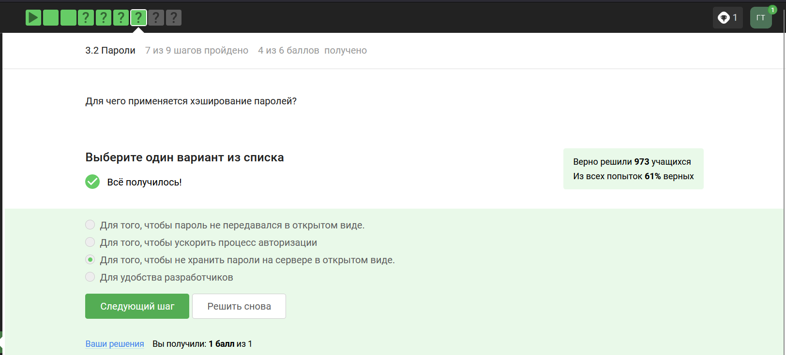{#fig:007 width=70%}

Хэш-функцию используют для проверки целостности передаваемых, зашифрованных сообщений, для хранения паролей на сервере, и для так называемых протоколов доказательства работы или proof of work: это используется в биткоине для майнинга. 

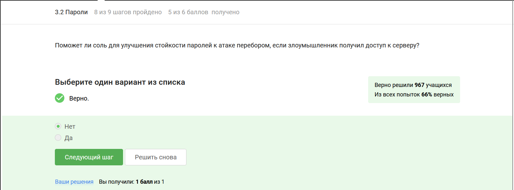{#fig:008 width=70%}

Соль "подсыпает" сервер, поэтому если есть доступ к серверу, то и доступ к хэшу, и к соли у него тоже будет.

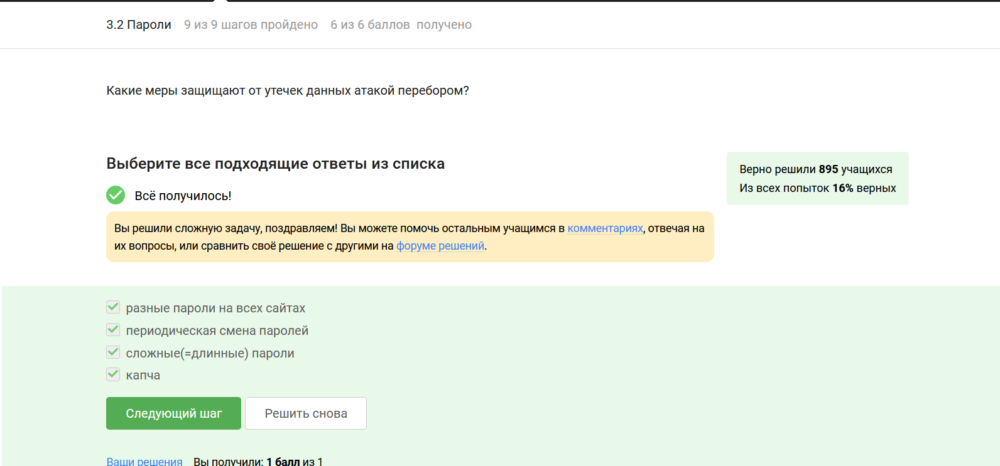{#fig:009 width=70%}

Понятно, что нужно использовать длинные пароли с максимально большим алфавитом, хранить их стоит в менеджерах паролей, пароли нужно менять достаточно регулярно, особенно к таким критическим сервисам, как почта. Политика (особенно больших компаний) по безопасности состоит в том, что пароли нужно менять. И для разных сайтов, и для разных программ нужно использовать разные пароли, поскольку компрометация одного из них может вести к компрометации всех остальных, если вы используете одинаковые пароли.

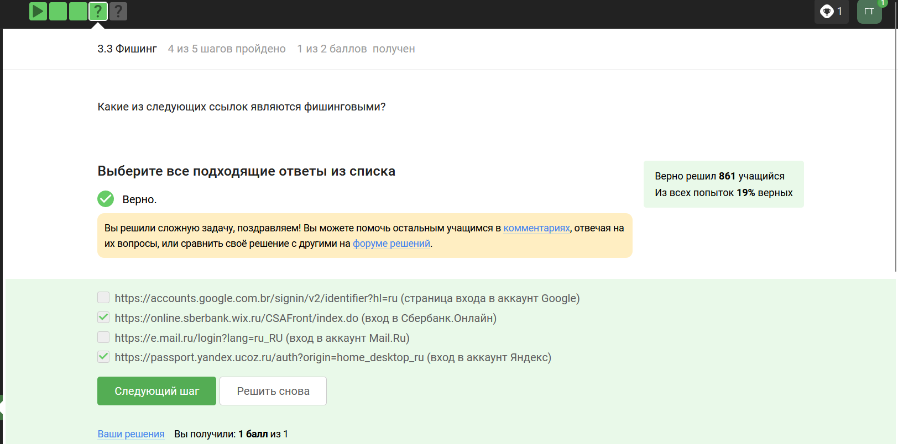{#fig:010 width=70%}

Другой пример фишинга - эта маскировка под известные веб-сайты только с другим доменным именем, начало может быть одинаковое или середина. В моем примере с vk.com понятно, на какой сервис это ссылается, ну а потом идет какая-то белиберда, которая не имеет ничего общего с реальной ссылкой. Естественно, никакие данные вводить сюда нельзя, но и более того, заметьте, что соединение вот с этим сайтом произошло не по HTTPS протоколу, а по небезопасному HTTP протоколу, это тоже звоночек, потому что с этого сайта лучше побыстрее уйти. 

wix.ru

ucoz.ru

Это звоночки фишинга.

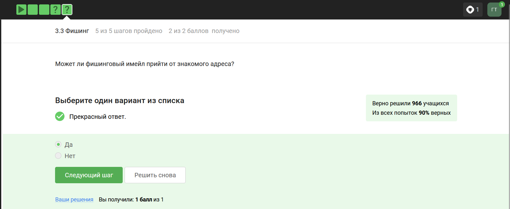{#fig:011 width=70%}

Можем ли мы получить вот такое фишинговое письмо от отправителя, которого мы знаем? Это называется email spoofing/спуфинг от английского spoof – подменить. И спуфинг – это глобальный термин атак, есть IP spoofing - это подмена IP-адреса, есть email spoofing - подмена адреса отправителя. 

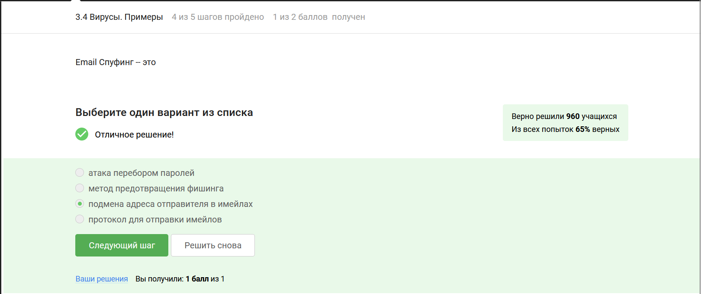{#fig:012 width=70%}

Это называется email spoofing/спуфинг от английского spoof – подменить. И спуфинг – это глобальный термин атак, есть IP spoofing - это подмена IP-адреса, есть email spoofing - подмена адреса отправителя. 

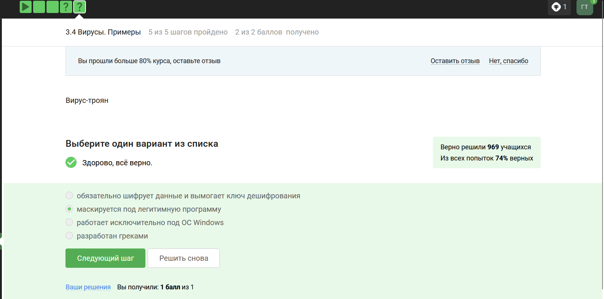{#fig:013 width=70%}

Троян - это вирус, который проникает в систему под видом какого-то легитимного программного обеспечения, это аллюзия к троянскому коню.

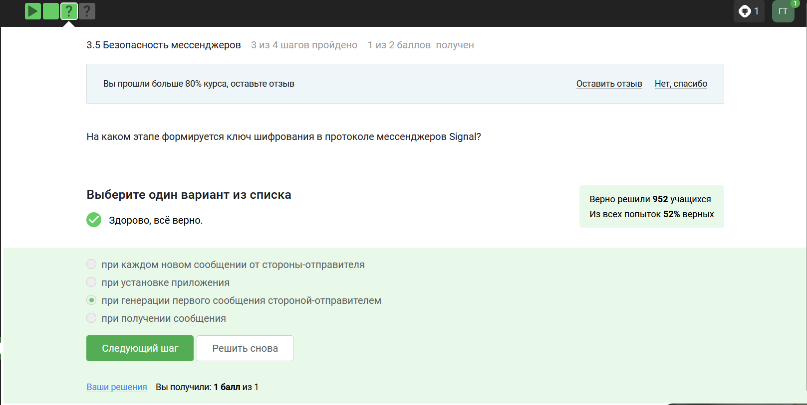{#fig:014 width=70%}

Вначале мы генерируем общий ключ, для этого опять же рассмотрим 2 людей, 2 смартфона - Алиса и Боб. Алиса хочет отправить какое-то сообщение Бобу. Что делает Боб? Боб публикует на сервере свою открытую информацию, то есть открытый кусочек своего ключа. Если Алиса хочет отправить какое-то сообщение Бобу, она берет этот открытый кусочек ключа от Боба, генерирует общий ключ и с помощью этого общего ключа отправляет сообщение уже зашифрованное под этим общим ключом Бобу. Кроме этого зашифрованного сообщения, она отправляет Бобу свой кусочек открытого ключа, при этом Боб, получив этот кусочек открытого ключа, имея какую-то свою секретную информацию, формирует тот же самый общий ключ, с помощью которого Алиса шифровала сообщение. Получив зашифрованное сообщение и вычислив общий ключ, Боб может уже дешифровать корректно это сообщение. 

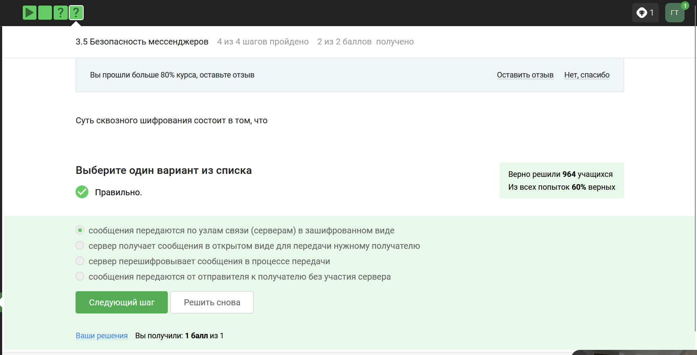{#fig:015 width=70%}

Достигается она с помощью, во-первых, сквозного шифрования - это парадигма большого числа безопасных коммуникаций; сквозное шифрование - по-английски E2E или End-to-End encryption. Суть довольно простая: у нас есть два участника - Алиса и Боб, A и B, и сквозное шифрование заключается в том, что сервер, который передает сообщение, который направляет сообщение от Алисы к Бобу или от Бобу к Алисе, знает только то, куда эти сообщения должны быть направлены, но сообщения он передает в зашифрованном виде, то есть он как бы работает маршрутизатором  сообщений, не зная о том, что он передает. Что происходит, если мы хотим отправить сообщение от Алисы к Бобу? Алиса шифрует свои данные, кладет на сервере шифр-текст с пометкой, что этот шифр-текст предназначен для Боба. Когда Боб заходит в сеть, сервер видит: «Ага, Боб зашел в сеть, надо обновить его сообщение», и отправляет шифр-текст от Алисы. Боб получает этот шифр-текст, дешифрует его, получает сообщение в открытом виде. При этом сервер не знает ни ключ, с помощью которого Алиса шифровала, ни тем более сообщение в открытом виде. 

::: {#refs}
:::
