---
## Front matter
title: "Отчет о третьем модуле внешнего курса"
subtitle: "Криптография на практике"
author: "Ганина Таисия Сергеевна"

## Generic otions
lang: ru-RU
toc-title: "Содержание"

## Bibliography
bibliography: bib/cite.bib
csl: pandoc/csl/gost-r-7-0-5-2008-numeric.csl

## Pdf output format
toc: true # Table of contents
toc-depth: 2
lof: true # List of figures
lot: true # List of tables
fontsize: 12pt
linestretch: 1.5
papersize: a4
documentclass: scrreprt
## I18n polyglossia
polyglossia-lang:
  name: russian
  options:
	- spelling=modern
	- babelshorthands=true
polyglossia-otherlangs:
  name: english
## I18n babel
babel-lang: russian
babel-otherlangs: english
## Fonts
mainfont: PT Serif
romanfont: PT Serif
sansfont: PT Sans
monofont: PT Mono
mainfontoptions: Ligatures=TeX
romanfontoptions: Ligatures=TeX
sansfontoptions: Ligatures=TeX,Scale=MatchLowercase
monofontoptions: Scale=MatchLowercase,Scale=0.9
## Biblatex
biblatex: true
biblio-style: "gost-numeric"
biblatexoptions:
  - parentracker=true
  - backend=biber
  - hyperref=auto
  - language=auto
  - autolang=other*
  - citestyle=gost-numeric
## Pandoc-crossref LaTeX customization
figureTitle: "Рис."
tableTitle: "Таблица"
listingTitle: "Листинг"
lofTitle: "Список иллюстраций"
lotTitle: "Список таблиц"
lolTitle: "Листинги"
## Misc options
indent: true
header-includes:
  - \usepackage{indentfirst}
  - \usepackage{float} # keep figures where there are in the text
  - \floatplacement{figure}{H} # keep figures where there are in the text
---

# Выполнение заданий модуля

Выполнение заданий. (рис. @fig:001, @fig:002, @fig:003, @fig:004, @fig:005, @fig:006, @fig:007, @fig:008, @fig:009, @fig:010, @fig:011, @fig:012, @fig:013, @fig:014, @fig:015, @fig:016).

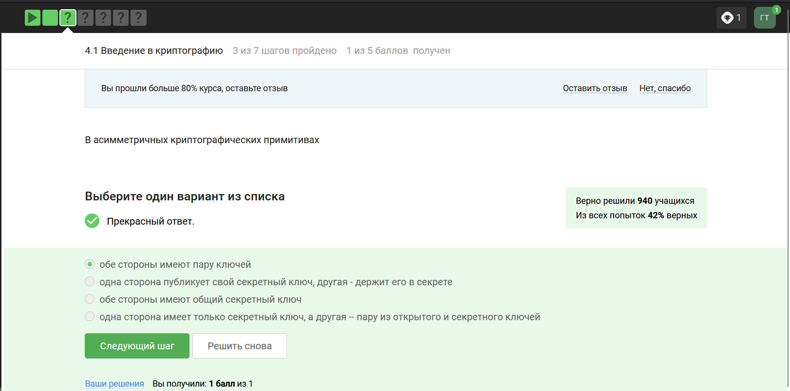{#fig:001 width=70%}

В асимметричной криптографии (её еще называют криптографией с открытым ключом) у каждой из сторон есть пара ключей: открытый ключ и секретный ключ.

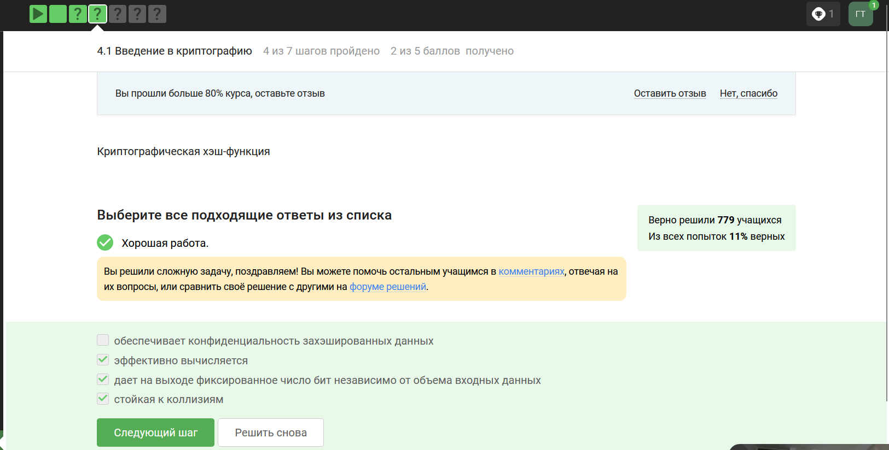{#fig:002 width=70%}

Криптографическая хэш-функция берет на вход произвольный объем данных, то есть какие-то биты и выдает на выходе фиксированную строку, например длины n. Важно, что, как правило, функция сжимает данные: она берет большой набор данных и выдаёт потом маленькое фиксированное значение. 
Важное свойство криптографической хэш-функций, то, что делает её криптографической – это стойкость к коллизиям.

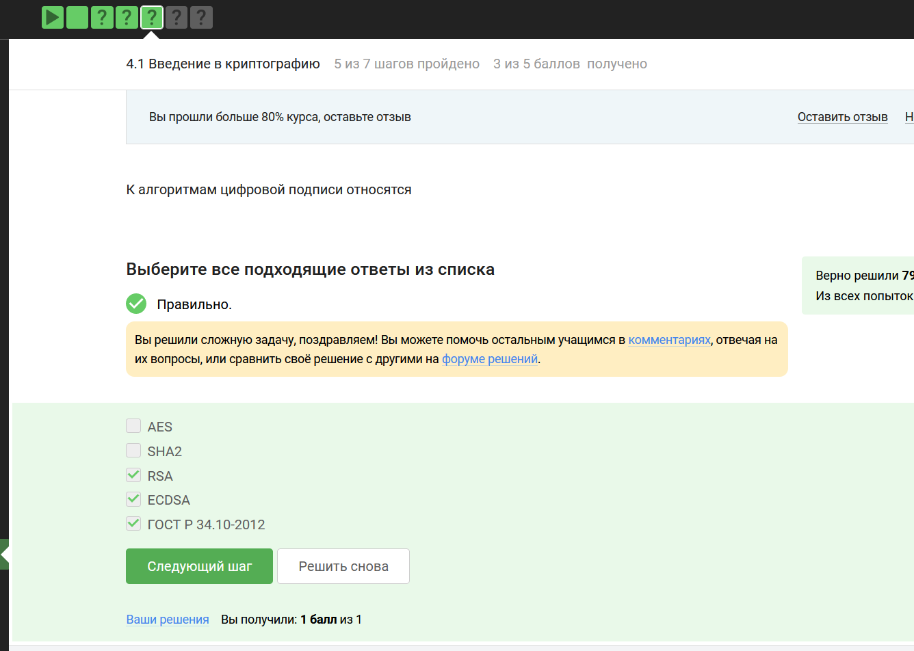{#fig:003 width=70%}

К примерам цифровой подписи относятся интернет-сертификаты, подпись RSA, американский стандарт ECDSA и отечественный стандарт ГОСТ стандарт P 34.20.2012. 

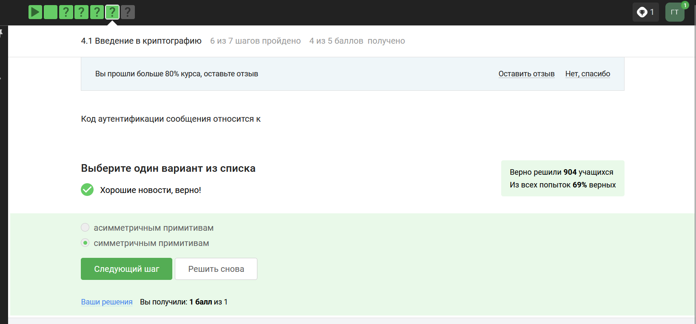{#fig:004 width=70%}

Как правило, код аутентификации сообщения строится с помощью хэш-функции или симметричного шифрования. 

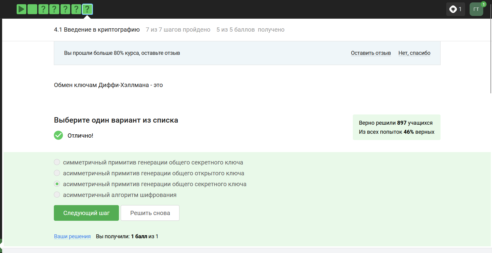{#fig:005 width=70%}

Самым популярным примером протокола обмена ключами является протокол Диффи-Хэллмана, как раз он, либо его модификации используются в современных мессенджерах и в протоколе TLS для того, чтобы мы смогли сгенерировать общий секретный ключ и дальше шифровать наши данные с помощью симметричного алгоритма, то есть с помощью ключа skAB. Если реализовать генерацию общего ключа так, как она описана у Диффи-Хэллмана, мы получим довольно слабый протокол, нестойкий к активным злоумышленникам. Сделать этот протокол стойким к активным злоумышленникам помогает цифровая подпись. 

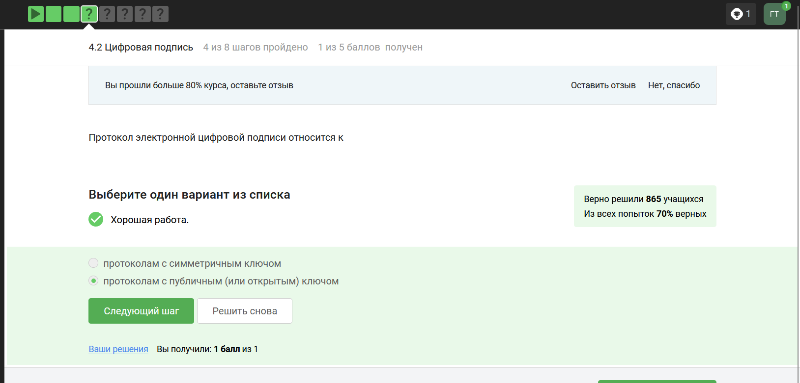{#fig:006 width=70%}

Если говорить более формально о том, что такое электронно-цифровая подпись, то это криптографический примитив, который состоит из трех эффективных алгоритмов. Эффективный алгоритм означает, что мы можем быстро его запустить на не сильно мощной машине. Первый алгоритм занимается генерацией ключей, он генерирует публичный ключ и секретный ключ. Публичный ключ мы держим в открытом доступе, секретный ключ – у себя, никому не показываем. Секретный ключ еще называется подписывающим ключом, а открытый – проверяющим или ключом верификации. Второй алгоритм – это генерация подписи, которая берет на вход сообщение и секретный ключ и выдает нам подпись. И третий – это верификация подписи, которая берёт на вход подпись, сообщение и открытый ключ и выдает нам либо тот факт, что подпись верна, либо тот факт, что подпись неверна. 

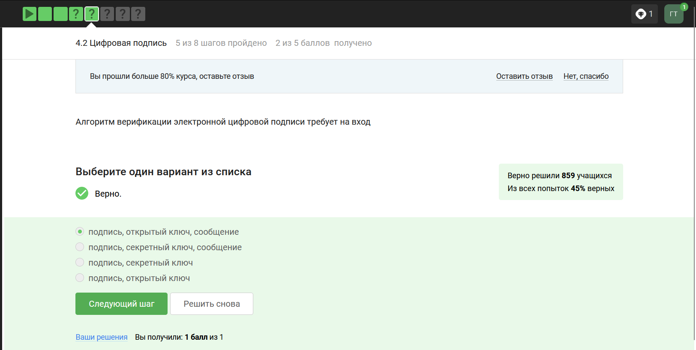{#fig:007 width=70%}

Верификация подписи берёт на вход подпись, сообщение и открытый ключ и выдает нам либо тот факт, что подпись верна, либо тот факт, что подпись неверна. 

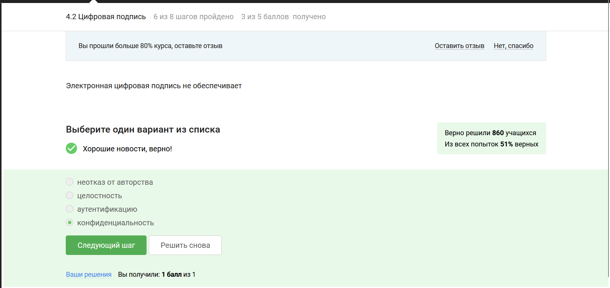{#fig:008 width=70%}

Цифровая подпись предназначена, во-первых, для обеспечения целостности сообщения, иными словами, если сообщение в процессе передачи было изменено, то подпись этого измененного сообщения будет проверена некорректно, то есть при проверке корректности подписи мы узнаем о том, что сообщение было изменено.
Во-вторых, цифровая подпись обеспечивает аутентификацию сообщения, то есть мы можем установить принадлежность подписи владельцу, иными словами, никто другой не смог бы поставить такую подпись под этим сообщением. 
Ну и последнее, третье – это неотказ от авторства, то есть как только подпись подписана, подписавший её человек не может отказаться от того факта, что он ее подписал. 

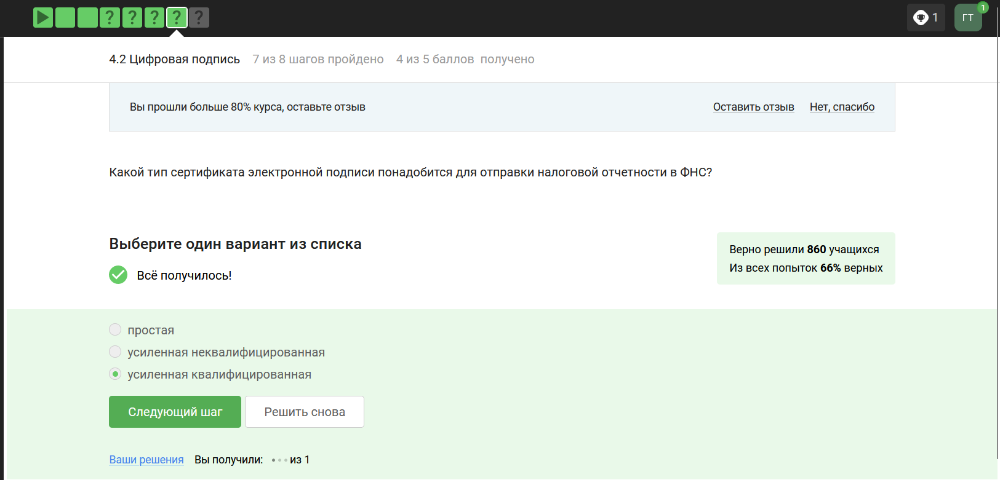{#fig:009 width=70%}

Что касается усиленной квалифицированной подписи, эта подпись уже имеет юридическую силу, она, как правило, равнозначна рукописной.

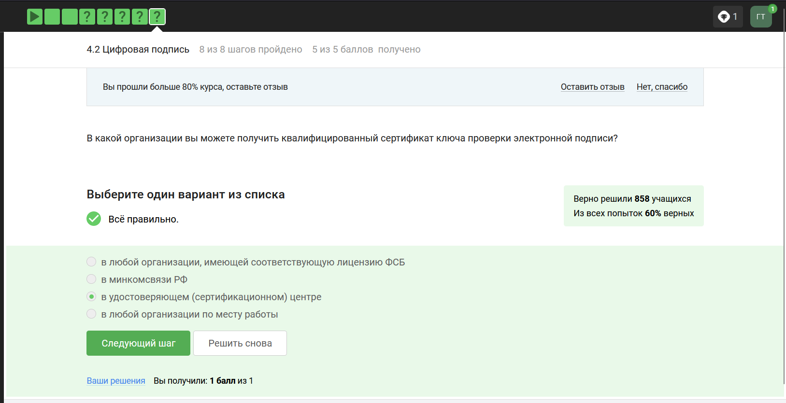{#fig:010 width=70%}

А вот что касается усиленной квалифицированной подписи, эта подпись уже имеет юридическую силу, она, как правило, равнозначна рукописной. Для того, чтобы получить такую подпись, вам нужно пойти со своим паспортом и с другими данными в сертификационный центр, который должен быть аккредитован конкретным министерством. Такие подписи используются на Госуслугах, в государственном документообороте.

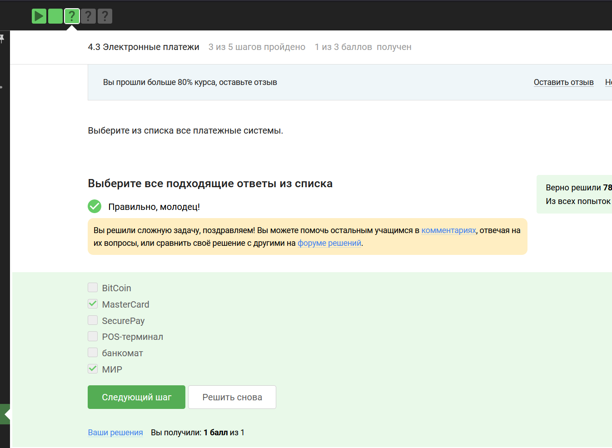{#fig:011 width=70%}

Домен совместимости (за этот домен отвечает платежная система, которая поддерживает ваш банк-эмитент, работающий в фоне всех ваших транзакций – их много, например, Visa, Mastercard, МИР) 

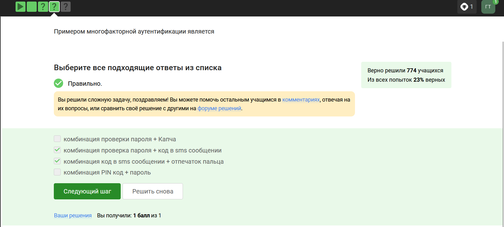{#fig:012 width=70%}

Многократная аутентификация заключается в том, что мы доказываем в ходе этого протокола несколько вещей есть. Основные категории вещей, которые мы можем доказать: 1) то, что я знаю – это либо пароль, либо PIN-код, либо в случае онлайн-платежей это секретный код, 2) конкретно в онлайн-платежах мы еще используем второй фактор – это то, чем я владею, например, телефон, именно поэтому нам часто приходит код, который вы должны подтвердить или вбить в ваш браузер, 3) другой фактор аутентификации – это свойства, например, биометрия, опечаток пальца, сетчатки глаза, 4) четвертый фактор аутентификации – локация. Способ аутентификации, как правило, выбирается банком. 

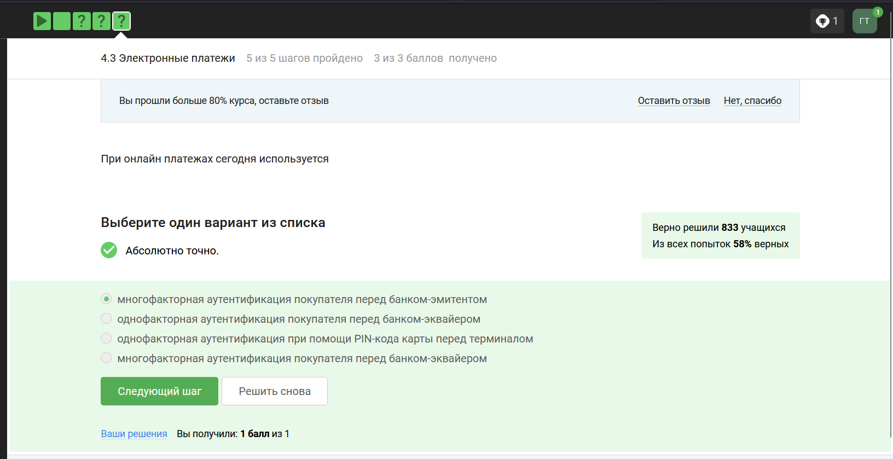{#fig:013 width=70%}

В аутентификации при покупке утверждение, которое я как покупатель хочу доказать, это то, что это моя карта и она мне принадлежит. Вообще, аутентификация может осуществляться не только при покупке, онлайн-платежах, она может осуществляется, когда мы открываем свою машину бесконтактным ключом, мы тоже пытаемся себя аутентифицировать.
Также важно помнить что, существует платежная система без двойной аутентификации, раньше они были популярны, сейчас, скорее всего, они уже менее популярны, это карточки Visa Electron, MasterCard Maestro, с помощью этих карт нельзя осуществлять онлайн-платежи, в потому что эти карты не поддерживают двойную аутентификацию, но как минимум двойная аутентификация должна быть поддержана, если мы хотим оплачивать покупки онлайн. 

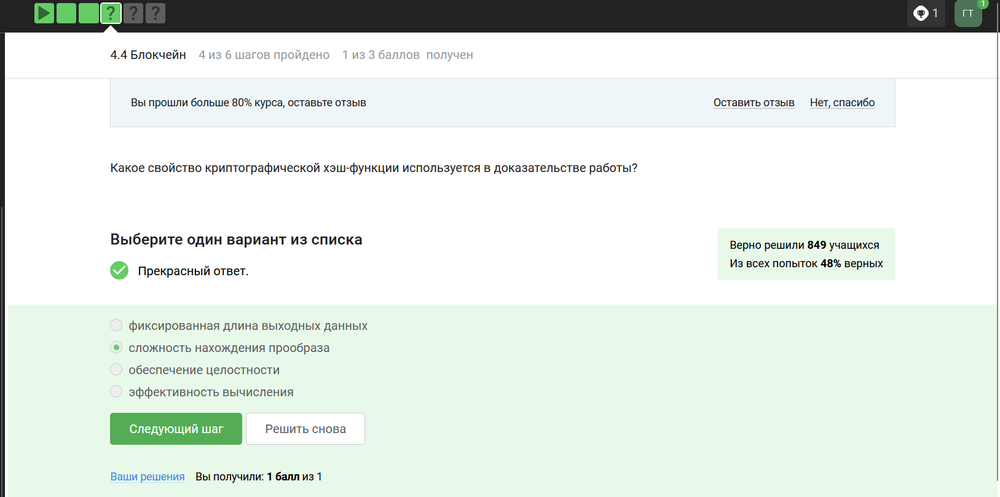{#fig:014 width=70%}

На сегодняшний день самый современный протокол - это доказательство работы или proof of work. В этом случае мы говорим о вычислительных ресурсах, в которых все майнеры ограничены. Для того, чтобы доказать, что майнер сделал какую-то работу, чтобы сформировать блок, ему нужно решить некоторую нетривиальную задачу. Выбирается специальная задача, о которой мы знаем, что потребуется как минимум столько-то времени, чтобы ее решить. Тот майнер, который первый решает эту задачу, имеет право добавить блок в блокчейн. Он потратил какие-то свои ресурсы вычислительные, электроэнергию, и он за нее получает награду. 

Такое доказательство применяется сегодня в биткоине, основным его недостатком является высокая энергопотребляемость. 

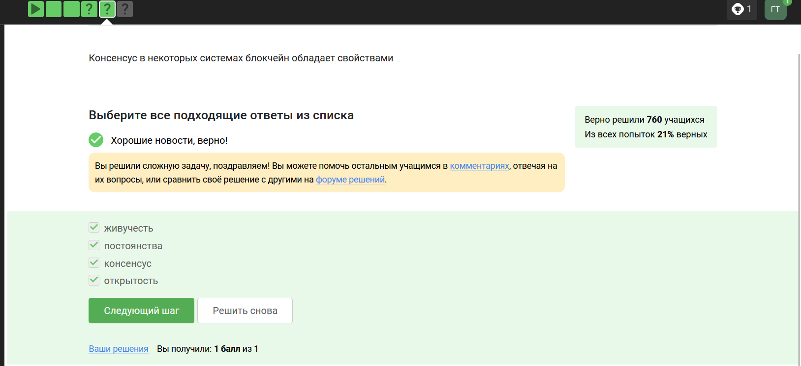{#fig:015 width=70%}

Первое - это постоянство, то есть когда-либо добавленНые данные не должны быть удалены из этой структуры. Второе - это сам консенсус, то есть все участники видят одни и те же данные и соглашаются с одним и теми же данными, исключением могут быть последние пары блоков, то есть последние изменения в этом блокчейне, в этой публичной структуре данных. Третье - это живучесть, это означает, что мы можем добавлять новые транзакции, когда хотим, мы можем осуществлять платежи, когда хотим. И последнее четвертое свойство - это открытость, то есть любой человек может быть участником блокчейна. Это справедливо не для всех блокчейнов, для биткоина это справедливо. 

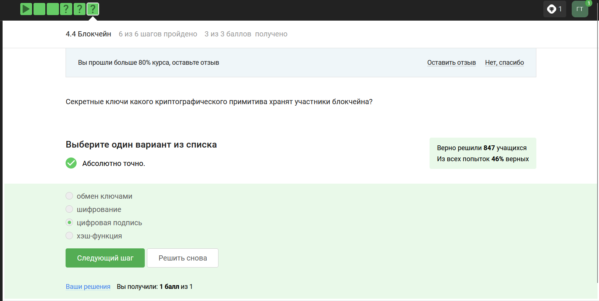{#fig:016 width=70%}

Допустим, у нас вами есть в блокчейне 3 участника, которые обмениваются друг с другом транзакциями. Важно то, что у каждого участника есть свой секретный ключ, и своим секретным ключом мы всегда будем подтверждать какую-то транзакцию. Важно то, что этот ключ у нас секретный, мы его используем для подписи. Подпись – это и есть подтверждение моей транзакции.

::: {#refs}
:::
