---
## Front matter
lang: ru-RU
title: Презентация к первому этапу проекта
subtitle: Установка и конфигурация операционной системы на виртуальную машину
author:
  - Ганина Т. С.
institute:
  - Российский университет дружбы народов, Москва, Россия
date: 28 февраля 2024

## i18n babel
babel-lang: russian
babel-otherlangs: english

## Formatting pdf
toc: false
toc-title: Содержание
slide_level: 2
aspectratio: 169
section-titles: true
theme: metropolis
header-includes:
 - \metroset{progressbar=frametitle,sectionpage=progressbar,numbering=fraction}
 - '\makeatletter'
 - '\beamer@ignorenonframefalse'
 - '\makeatother'
---

# Информация

## Докладчик

:::::::::::::: {.columns align=center}
::: {.column width="70%"}

  * Ганина Таисия
  * Студентка 2 курса, НКАбд-01-22
  * Направление "Компьютерные и информационные науки"
  * Российский университет дружбы народов
  * [Гитхаб](https://github.com/tsganina/study_2023-2024_infosec)
  * <https://tsganina.github.io/>

:::
::: {.column width="30%"}

:::
::::::::::::::

# Вводная часть

## Актуальность

- Умение работать с разными операционными системами необходимо для хорошего специалиста.
- ОС Linux является одной из самых известных операционных систем, умение установить систему и пользоваться ей может пригодиться в жизни и в работе.
- Навык настройки виртуальной машины позволит научиться работать с разными операционными системами, протестировать их, а так же оценить функционал каждой.

## Объект и предмет исследования

- Программа VirtualBox;
- ОС Linux;

## Цели и задачи

- Приобретение практических навыков установки операционной системы на виртуальную машину;
- Навык настройки минимально необходимых для дальнейшей работы сервисов;

# Настройка виртуальной машины

## Настройка параметров

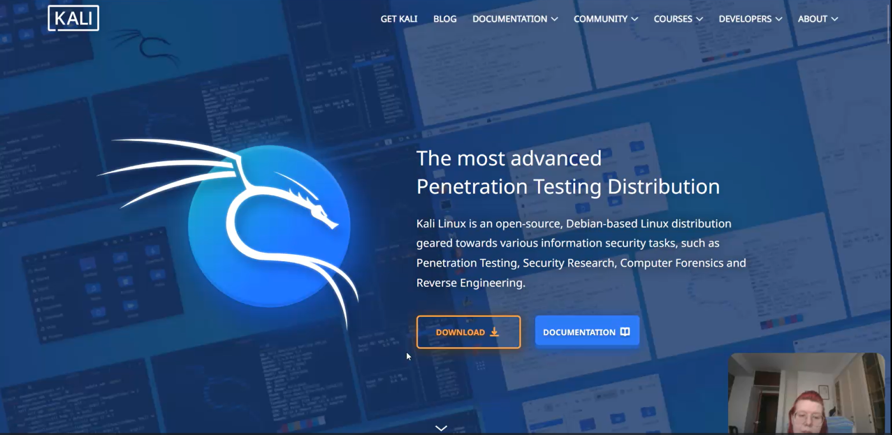{#fig:001 width=70%}

##

{#fig:002 width=70%}

##

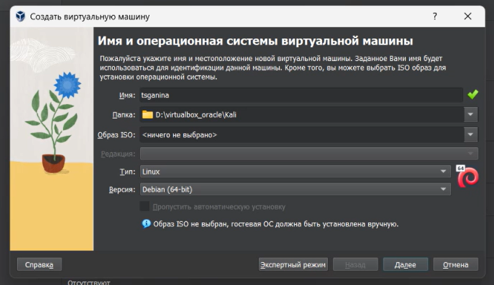{#fig:003 width=70%}

## Установка Kali

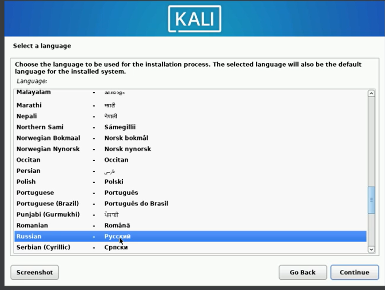{#fig:007 width=70%}

##

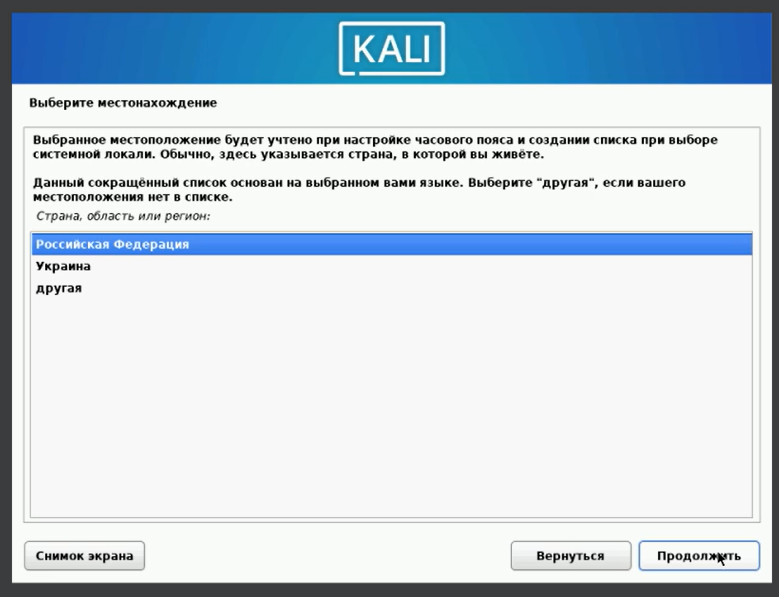{#fig:008 width=70%}

##

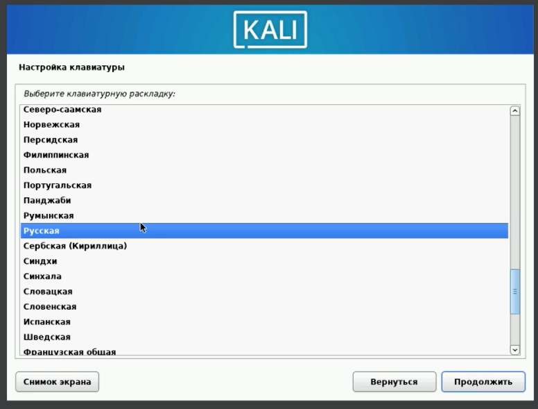{#fig:009 width=70%}

##

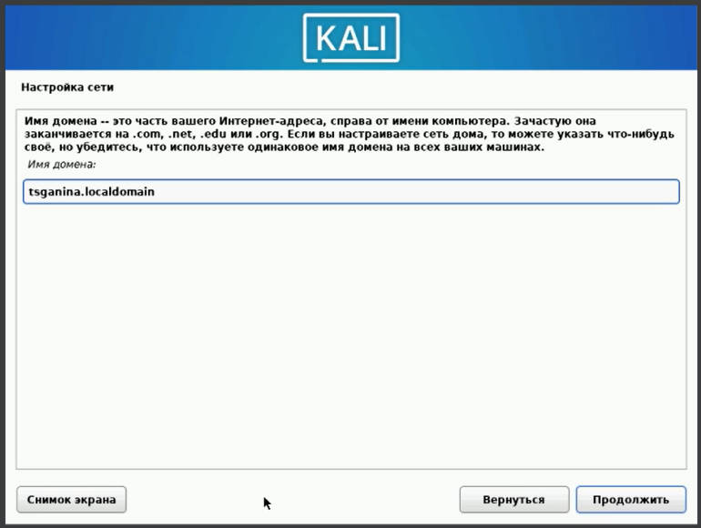{#fig:012 width=70%}

##

{#fig:013 width=70%}

##

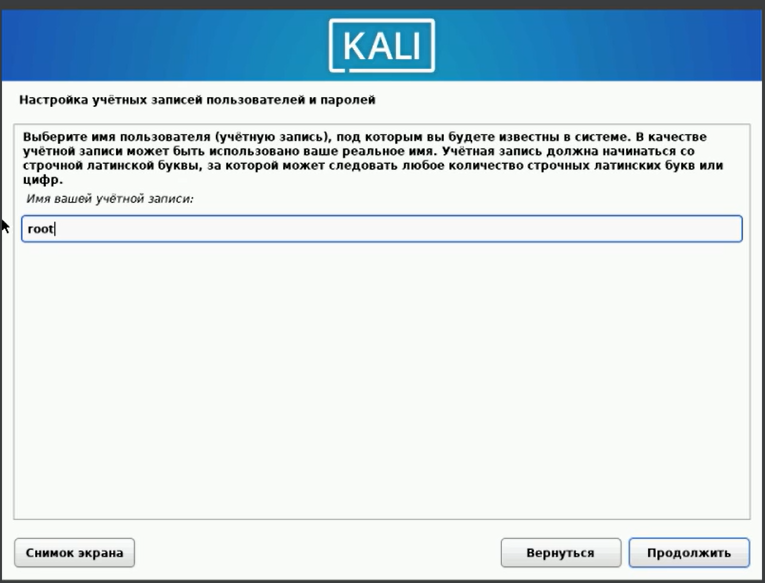{#fig:014 width=70%}

##

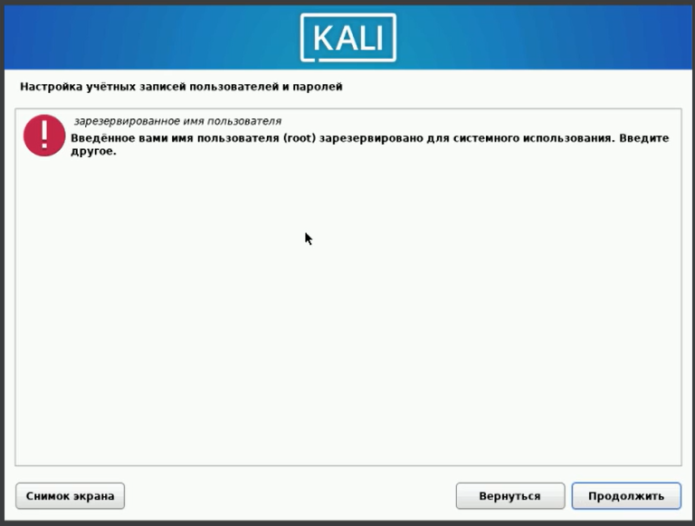{#fig:015 width=70%}

##

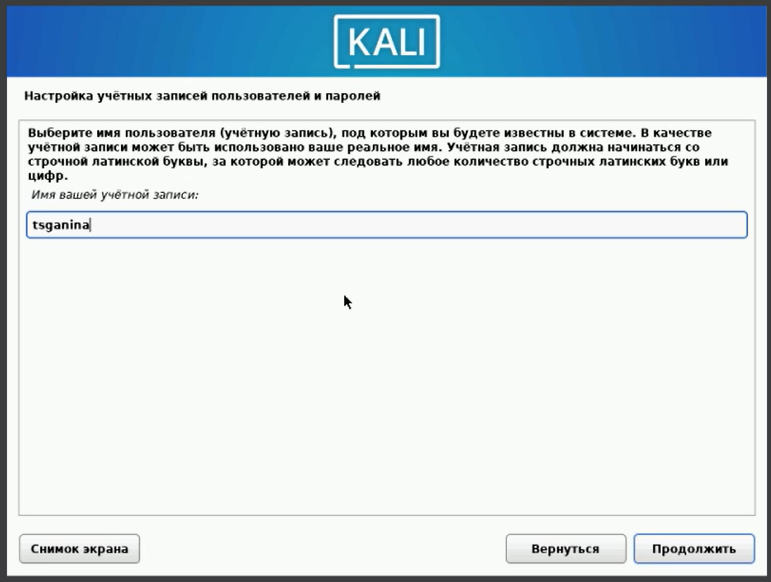{#fig:016 width=70%}

##

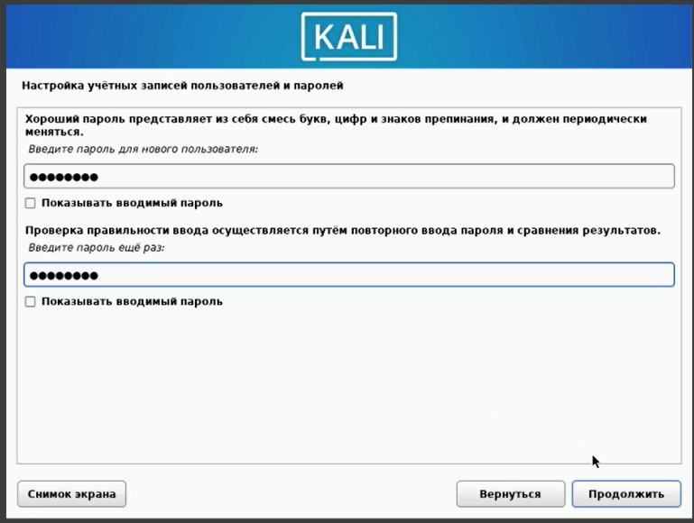{#fig:017 width=70%}

##

{#fig:024 width=70%}

# Результаты

##

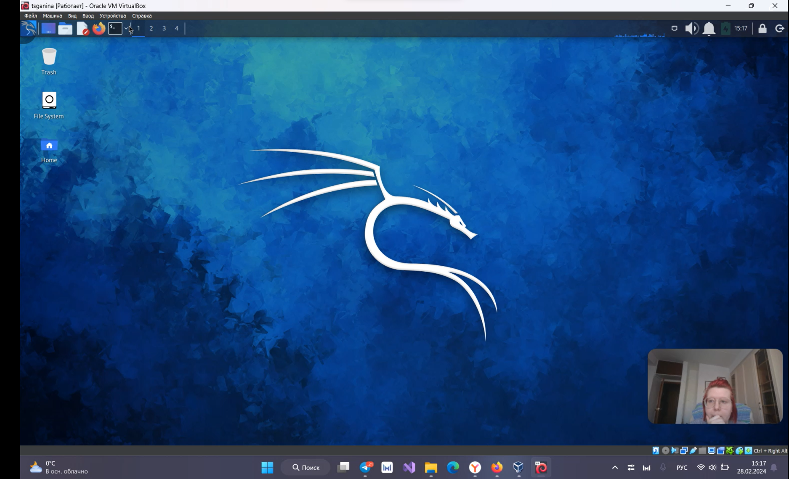{#fig:025 width=70%}
