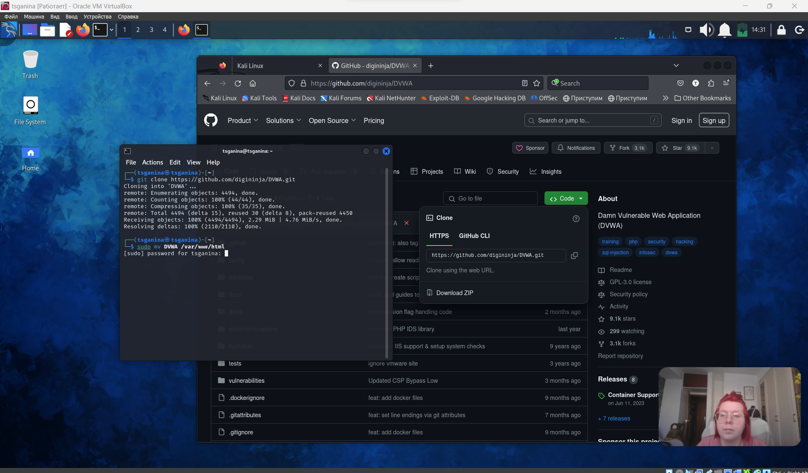
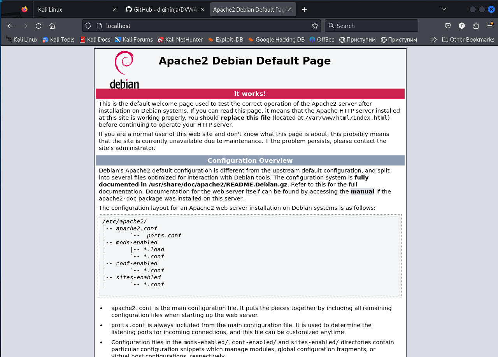
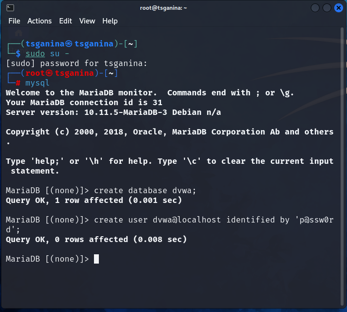
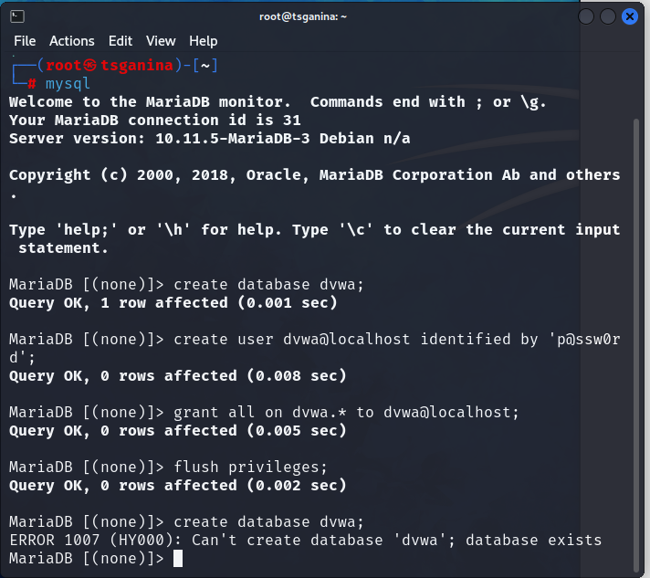
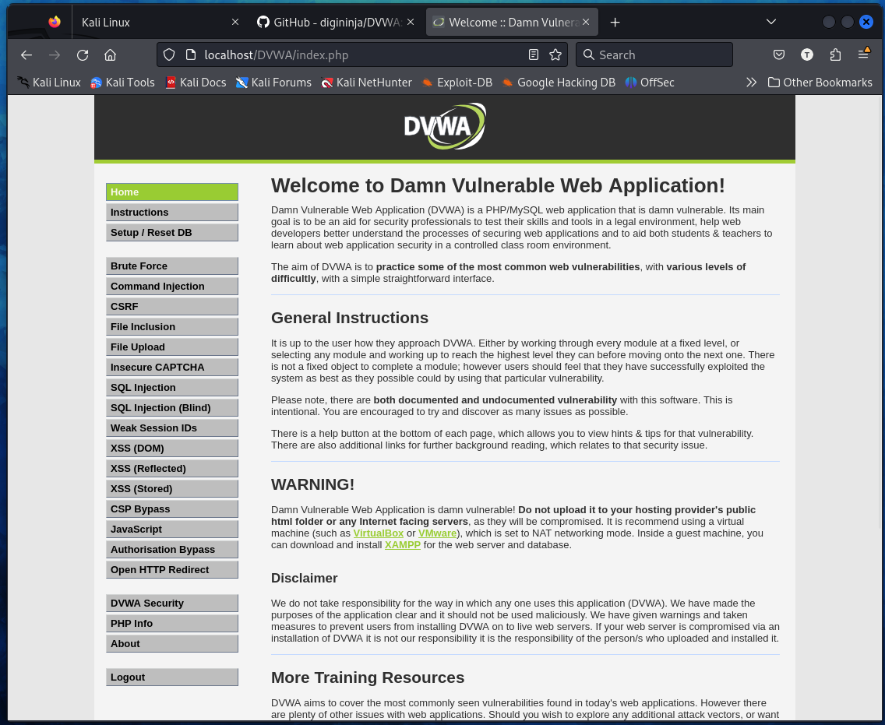
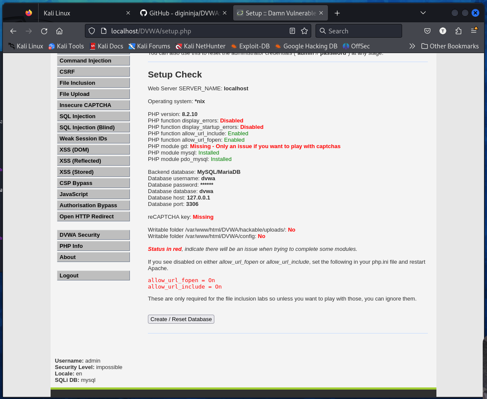
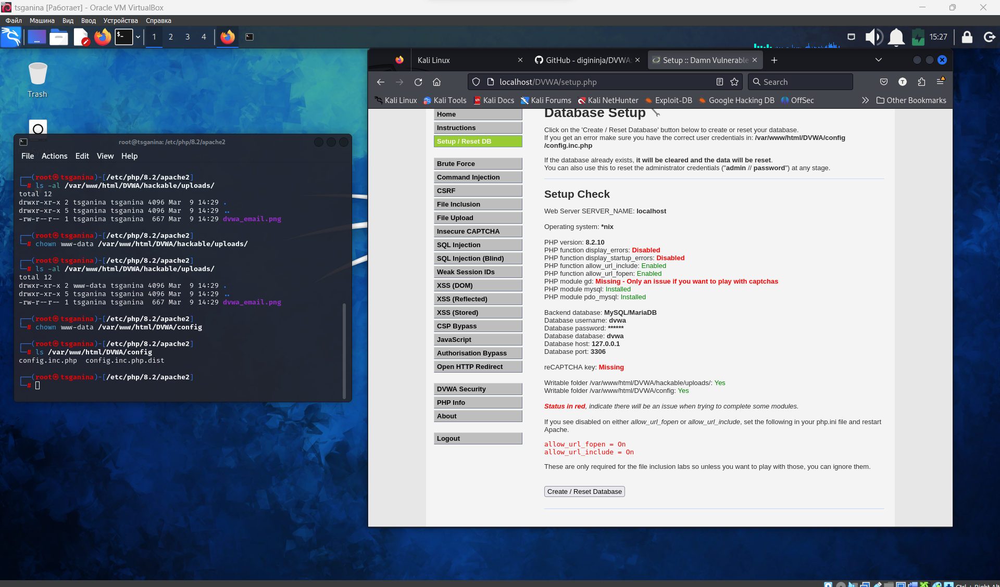

---
## Front matter
lang: ru-RU
title: Презентация ко второму этапу проекта
subtitle: Установка DVWA
author:
  - Ганина Т. С.
institute:
  - Российский университет дружбы народов, Москва, Россия
date: 13 марта 2024

## i18n babel
babel-lang: russian
babel-otherlangs: english

## Formatting pdf
toc: false
toc-title: Содержание
slide_level: 2
aspectratio: 169
section-titles: true
theme: metropolis
header-includes:
 - \metroset{progressbar=frametitle,sectionpage=progressbar,numbering=fraction}
 - '\makeatletter'
 - '\beamer@ignorenonframefalse'
 - '\makeatother'
---

# Информация

## Докладчик

:::::::::::::: {.columns align=center}
::: {.column width="70%"}

  * Ганина Таисия
  * Студентка 2 курса, НКАбд-01-22
  * Направление "Компьютерные и информационные науки"
  * Российский университет дружбы народов
  * [Гитхаб](https://github.com/tsganina/study_2023-2024_infosec)
  * <https://tsganina.github.io/>

:::
::: {.column width="30%"}

:::
::::::::::::::

# Вводная часть

## Объект и предмет исследования

- DVWA

## Цели и задачи

- Приобретение практических навыков установки DVWA

# Установка DVWA

## Клонирую репозиторий.

{#fig:002 width=70%}

##

{#fig:004 width=70%}

##

{#fig:009 width=70%}

##

{#fig:013 width=70%}

##

{#fig:014 width=70%}

##

{#fig:015 width=70%}

# Результаты

##

{#fig:019 width=70%}
