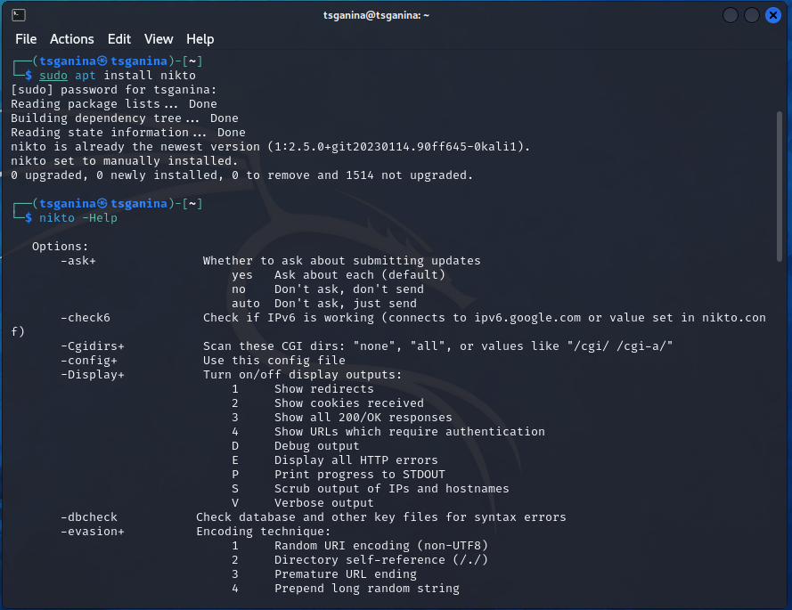
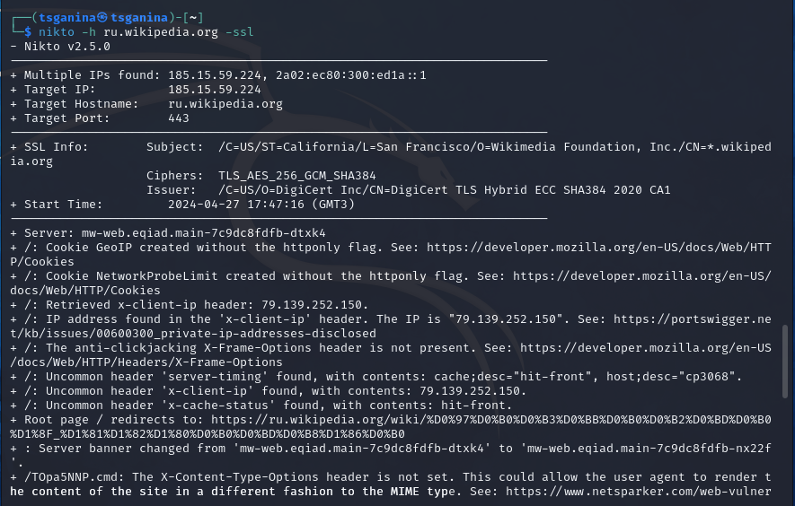
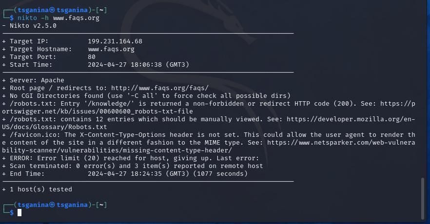

---
## Front matter
title: "Отчет по 4 этапу персонального проекта"
subtitle: "Основы информационной безопасности"
author: "Ганина Таисия Сергеевна, НКАбд-01-22"

## Generic otions
lang: ru-RU
toc-title: "Содержание"

## Bibliography
bibliography: bib/cite.bib
csl: pandoc/csl/gost-r-7-0-5-2008-numeric.csl

## Pdf output format
toc: true # Table of contents
toc-depth: 2
lof: true # List of figures
lot: true # List of tables
fontsize: 12pt
linestretch: 1.5
papersize: a4
documentclass: scrreprt
## I18n polyglossia
polyglossia-lang:
  name: russian
  options:
	- spelling=modern
	- babelshorthands=true
polyglossia-otherlangs:
  name: english
## I18n babel
babel-lang: russian
babel-otherlangs: english
## Fonts
mainfont: PT Serif
romanfont: PT Serif
sansfont: PT Sans
monofont: PT Mono
mainfontoptions: Ligatures=TeX
romanfontoptions: Ligatures=TeX
sansfontoptions: Ligatures=TeX,Scale=MatchLowercase
monofontoptions: Scale=MatchLowercase,Scale=0.9
## Biblatex
biblatex: true
biblio-style: "gost-numeric"
biblatexoptions:
  - parentracker=true
  - backend=biber
  - hyperref=auto
  - language=auto
  - autolang=other*
  - citestyle=gost-numeric
## Pandoc-crossref LaTeX customization
figureTitle: "Рис."
tableTitle: "Таблица"
listingTitle: "Листинг"
lofTitle: "Список иллюстраций"
lotTitle: "Список таблиц"
lolTitle: "Листинги"
## Misc options
indent: true
header-includes:
  - \usepackage{indentfirst}
  - \usepackage{float} # keep figures where there are in the text
  - \floatplacement{figure}{H} # keep figures where there are in the text
---

# Цель работы

Научиться работе с Nikto.

# Задание

Протестировать веб-сайт при помощи nikto.

# Теоретическое введение

Nikto – бесплатный (open source) сканер для поиска уязвимостей в веб-серверах. Утилита относиться к классу blackbox сканеров, т. е. сканеров, использующих стратегию сканирования методом черного ящика. Это значит, что заранее неизвестно о внутреннем устройстве программы/сайта (доступ к исходному коду отсутствует) и упор сделан на функциональность. Программа может обнаруживать более 6700 потенциально опасных файлов и уязвимостей. Новые уязвимости добавляются в базу данных программы по мере их возникновения. Помимо поиска уязвимостей, сканер производит поиск на наличие устаревших версий, используемых библиотек и фреймворков. Nikto не позиционируется как стелс сканер (стелс сканеры никогда не устанавливают TCP-соединения до конца, тем самым сканирование происходит скрытно) – при сканировании сайта в логах сайта или в любой другой системе обнаружения вторжений, если она используется, будет отображена информация о том, что сайт подвергается сканированию.

Первая версия Nikto под номером 1.00 была создана в 2001 году Американским инженером по информационной безопасности Крисом Сулло. На текущий момент последней актуальной версией является версия 2.1.6.

Среди функций Nikto можно выделить следующие:

    поддержка SSL,

    поддержка HTTP прокси;

    создание отчетов в текстовом формате, XML, HTML, NBE или CSV;

    возможность сканирования портов;

    поиск поддоменов;

    поддержка плагинов для расширения функционала сканирования.

# Выполнение лабораторной работы

Описываются проведённые действия, в качестве иллюстрации даётся ссылка на иллюстрацию (рис. @fig:001, @fig:002, @fig:003).

{#fig:001 width=70%}

{#fig:002 width=70%}

{#fig:003 width=70%}

# Выводы

Я опробовала работу с nikto и протестировала несколько сайтов.

# Список литературы{.unnumbered}

1. [Статья "Обзор сканера Nikto для поиска уязвимостей в веб-серверах"](https://habr.com/ru/companies/first/articles/731696/)

::: {#refs}
:::
